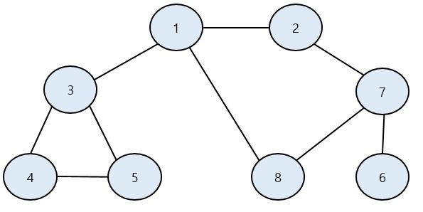
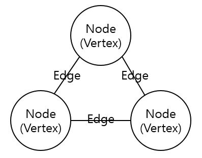
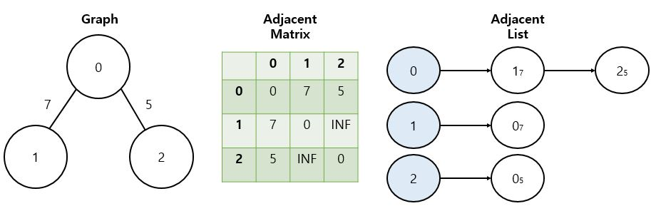
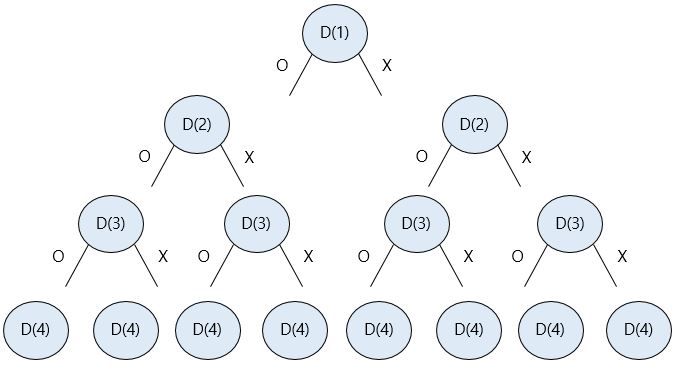

# 탐색 알고리즘 : DFS / BFS

스택, 큐, 재귀 함수는 DFS 와 BFS 에서 가장 중요한 개념이다.

## DFS(Depth-First Search) : 깊이 우선 탐색

DFS 는 깊이 우선 탐색이라고 부르며, `그래프에서 깊은 부분을 우선적으로 탐색`하는 알고리즘이다. DFS 는 `스택(Stack)` 자료구조를 사용한다.

- __동작 과정__
  - 탐색 시작 노드를 스택에 삽입하고 방문 처리를 한다.
  - 스택의 최상단 노드에 방문하지 않은 인접 노드가 있으면 그 인접 노드를 스택에 넣고 방문 처리를 한다. 방문하지 않은 인접 노드가 없으면 스택에서 최상단 노드를 꺼낸다.
    - 일반적으로 인접한 노드 중에서 방문하지 않은 노드가 여러 개 있으면 번호가 낮은 순서부터 처리한다.
  - 2번 과정을 더 이상 수행할 수 없을 때까지 반복한다.

> '방문 처리'는 스택에 한 번 삽입되어 처리된 노드가 다시 삽입되지 않게 체크하는 것을 의미한다. 방문 처리를 함으로써 각 노드를 한 번씩만 처리할 수 있다.



- 1부터 DFS 시작
  - 1을 스택에 넣고 방문 처리한다.
  - 방문하지 않은 인접 노드 중에서 가장 번호가 낮은 곳을 방문한다.
  - 2를 스택에 넣고 방문 처리한다.
  - 방문하지 않은 인접 노드 중에서 가장 번호가 낮은 곳을 방문한다. (2 기준으로 7)
  - 7을 스택에 넣고 방문 처리한다.
  - 방문하지 않은 인접 노드 중에서 가장 번호가 낮은 곳을 방문한다. (7 기준으로 6)
  - 6을 기준으로 방문하지 않은 인접 노드가 없으므로 스택에서 꺼낸다. (스택의 top 은 현재 7)
  - 방문하지 않은 인접 노드 중에서 가장 번호가 낮은 곳을 방문한다. (7 기준으로 8)
  - (반복)
  - 탐색 순서 결과(스택에 들어간 순서) : `1 -> 2 -> 7 -> 6 -> 8 -> 3 -> 4 -> 5`
    - 시간 복잡도 `O(N)`

DFS 는 스택을 이용하기 때문에 재귀 함수를 이용하여 구현하면 매우 간결하게 구현할 수 있다.

```java
public class Main {

    public static boolean[] visited = new boolean[9];
    public static ArrayList<ArrayList<Integer>> graph = new ArrayList<ArrayList<Integer>>();

    // DFS 함수 정의
    public static void dfs(int x) {
        // 현재 노드를 방문 처리
        visited[x] = true;
        System.out.print(x + " ");
        // 현재 노드와 연결된 다른 노드를 재귀적으로 방문
        for (int i = 0; i < graph.get(x).size(); i++) {
            int y = graph.get(x).get(i);
            if (!visited[y]) { 
              dfs(y);
            }
        }
    }

    public static void main(String[] args) {
        // 그래프 초기화
        for (int i = 0; i < 9; i++) {
            graph.add(new ArrayList<Integer>());
        }

        // 노드 1에 연결된 노드 정보 저장 
        graph.get(1).add(2);
        graph.get(1).add(3);
        graph.get(1).add(8);
        
        // 노드 2에 연결된 노드 정보 저장 
        graph.get(2).add(1);
        graph.get(2).add(7);
        
        // 노드 3에 연결된 노드 정보 저장 
        graph.get(3).add(1);
        graph.get(3).add(4);
        graph.get(3).add(5);
        
        // 노드 4에 연결된 노드 정보 저장 
        graph.get(4).add(3);
        graph.get(4).add(5);
        
        // 노드 5에 연결된 노드 정보 저장 
        graph.get(5).add(3);
        graph.get(5).add(4);
        
        // 노드 6에 연결된 노드 정보 저장 
        graph.get(6).add(7);
        
        // 노드 7에 연결된 노드 정보 저장 
        graph.get(7).add(2);
        graph.get(7).add(6);
        graph.get(7).add(8);
        
        // 노드 8에 연결된 노드 정보 저장 
        graph.get(8).add(1);
        graph.get(8).add(7);

        dfs(1);
    }
}
```
### 그래프(Graph)의 기본 구조



- __Graph__
  - Node(Vertex, 정점)
  - Edge(간선)
- __그래프 탐색이란?__
  - 하나의 노드를 시작으로 다수의 노드를 방문하는 것
- __인접(Adjacent)__
  - 두 노드가 간선으로 연결되어 있는 경우

### 그래프를 표현하는 방법

프로그래밍에서는 그래프를 크게 2가지 방식으로 표현할 수 있다.



- __인접 행렬(Adjacent Matrix)__
  - 2차원 배열로 그래프의 연결 관계를 표현하는 방식
  - 모든 관계를 저장하므로 노드의 개수가 많을 수록 메모리가 낭비율이 증가
  - 특정 노드 간의 연결 정보를 쉽게 확인할 수 있음
    - Ex. 노드 1과 7의 연결 정보 확인 : `graph[1][7]`
- __인접 리스트(Adjacent List)__
  - 리스트로 그래프의 연결 관계를 표현하는 방식
  - C++, Java 에서는 `LinkedList(연결 리스트)` 자료구조를 사용하여 구현
  - 특정 노드 간의 연결 정보를 확인하는데 어려움
    - 연결된 데이터를 하나 하나 확인해야 함
  - 특정 노드와 연결된 모든 인접 노드를 순회해야 하는 경우, 인접 리스트 방식이 인접 행렬 방식보다 메모리 낭비가 적음

#### 인접 행렬(Adjacent Matrix)

```java
public class Main {

    // 연결이 되어 있지 않는 노드끼리는 무한(Infinity)의 비용이라고 작성
    private static final int INF = Integer.MAX_VALUE;
    
    // 2차원 배열 이용해 인접 행렬 표현
    private static int[][] graph = {
        {0, 7, 5},
        {7, 0, INF},
        {5, INF, 0}
    };

    public static void main(String[] args) {
        // 그래프 출력
        for (int i = 0; i < 3; i++) {
            for (int j = 0; j < 3; j++) {
                System.out.print(graph[i][j] + " ");
            }
            System.out.println();
        }
    }
}
```

#### 인접 리스트(Adjacent List)

```java
class Node {

    private int index;
    private int distance;

    public Node(int index, int distance) {
        this.index = index;
        this.distance = distance;
    }

    public void show() {
        System.out.print("(" + this.index + "," + this.distance + ") ");
    }
}

public class Main {

    // 행(Row)이 3개인 인접 리스트 표현
    public static ArrayList<ArrayList<Node>> graph = new ArrayList<ArrayList<Node>>();

    public static void main(String[] args) {
        // 그래프 초기화
        for (int i = 0; i < 3; i++) {
            graph.add(new ArrayList<Node>());
        }

        // 노드 0에 연결된 노드 정보 저장 (노드, 거리)
        graph.get(0).add(new Node(1, 7));
        graph.get(0).add(new Node(2, 5));

        // 노드 1에 연결된 노드 정보 저장 (노드, 거리)
        graph.get(1).add(new Node(0, 7));

        // 노드 2에 연결된 노드 정보 저장 (노드, 거리)
        graph.get(2).add(new Node(0, 5));

        // 그래프 출력
        for (int i = 0; i < 3; i++) {
            for (int j = 0; j < graph.get(i).size(); j++) {
                graph.get(i).get(j).show();
            }
            System.out.println();
        }
    }
}
```

## BFS(Breadth-First Search) : 너비 우선 탐색

BFS 는 너비 우선 탐색 이라고 부르며, `가까운 노드 부터 탐색`하는 알고리즘이다. 즉, DFS 의 반대다. BFS 구현은 FIFO 방식인 `Queue` 자료구조를 이용하는 것이 정석이다.
인접한 노드를 반복적으로 큐에 넣도록 알고리즘을 작성하면 자연스럽게 먼저 들어온 것이 먼저 나가게 되어, 가까운 노드부터 탐색을 진행하게 된다.

- __동작 과정__
  - 탐색 시작 노드를 큐에 삽입하고 방문 처리를 한다.
  - 큐에서 노드를 꺼내 해당 노드의 인접 노드 중에서 방문하지 않은 노드를 모두 큐에 삽입하고 방문 처리를 한다.
  - 2번 과정을 더 이상 수행할 수 없을 때까지 반복한다.


- 1부터 DFS 시작
  - 1을 큐에 넣고 방문 처리한다.
  - 큐에서 노드 1을 꺼내고 방문하지 않은 인접 노드 2,3,8을 모두 큐에 넣고 방문 처리를 한다.
  - 큐에서 2를 꺼내고 방문하지 않은 인접 노드 7을 큐에 넣고 방문 처리를 한다.
  - 큐에서 3을 꺼내고 방문하지 않은 인접 노드 4,5를 모두 큐에 넣고 방문 처리를 한다.
  - 큐에서 8을 꺼내고 방문하지 않은 인접 노드가 없으므로 무시한다.
  - 큐에서 7을 꺼내고 방문하지 않은 인접 노드 6을 큐에 넣고 방문 처리를 한다.
  - 남아 있는 노드에 방문하지 않은 인접 노드가 없다. 따라서 남은 노드를 차례대로 꺼낸다.
  - 탐색 순서 결과(큐 들어간 순서) : `1 -> 2 -> 3 -> 8 -> 7 -> 4 -> 5 -> 6`
    - 시간 복잡도 `O(N)`
    - 일반적인 경우 실제 수행시간은 DFS 보다 좋다.

```java
public class Main {

    public static boolean[] visited = new boolean[9];
    public static ArrayList<ArrayList<Integer>> graph = new ArrayList<ArrayList<Integer>>();

    // BFS 함수 정의
    public static void bfs(int start) {
        Queue<Integer> q = new LinkedList<>();
        q.offer(start);
        // 현재 노드를 방문 처리
        visited[start] = true;
        // 큐가 빌 때까지 반복
        while(!q.isEmpty()) {
            // 큐에서 하나의 원소를 뽑아 출력
            int x = q.poll();
            System.out.print(x + " ");
            // 해당 원소와 연결된, 아직 방문하지 않은 원소들을 큐에 삽입
            for(int i = 0; i < graph.get(x).size(); i++) {
                int y = graph.get(x).get(i);
                if(!visited[y]) {
                    q.offer(y);
                    visited[y] = true;
                }
            }
        }
    }

    public static void main(String[] args) {
        // 그래프 초기화
        for (int i = 0; i < 9; i++) {
            graph.add(new ArrayList<Integer>());
        }

        // 노드 1에 연결된 노드 정보 저장 
        graph.get(1).add(2);
        graph.get(1).add(3);
        graph.get(1).add(8);
        
        // 노드 2에 연결된 노드 정보 저장 
        graph.get(2).add(1);
        graph.get(2).add(7);
        
        // 노드 3에 연결된 노드 정보 저장 
        graph.get(3).add(1);
        graph.get(3).add(4);
        graph.get(3).add(5);
        
        // 노드 4에 연결된 노드 정보 저장 
        graph.get(4).add(3);
        graph.get(4).add(5);
        
        // 노드 5에 연결된 노드 정보 저장 
        graph.get(5).add(3);
        graph.get(5).add(4);
        
        // 노드 6에 연결된 노드 정보 저장 
        graph.get(6).add(7);
        
        // 노드 7에 연결된 노드 정보 저장 
        graph.get(7).add(2);
        graph.get(7).add(6);
        graph.get(7).add(8);
        
        // 노드 8에 연결된 노드 정보 저장 
        graph.get(8).add(1);
        graph.get(8).add(7);

        bfs(1);
    }
}
```

## 정리

- __DFS__
  - 동작 원리 : 스택
  - 구현 방법 : 재귀 함수
  - `Key Point` : 재귀, 종료 조건, 방문처리
  - 시간 복잡도 O(N)
- __BFS__
  - 동작 원리 : 큐
  - 구현 방법 : 큐 
  - `Key Point` : 큐, 방문처리
  - 시간 복잡도 O(N)

1차원 배열이나 2차원 배열 또한 그래프로 생각하면 수월하게 문제를 풀 수 있다. 아래처럼 좌표를 그래프 형태로 바꿔서 생각할 수 있다. 코딩테스트에서 2차원 배열의 탐색 문제를 만나면
그래프 형태로 바꿔서 생각하면 풀이 방법을 조금 더 쉽게 떠올릴 수 있다.

```
(1,1) (1,2) (1,3)
(2,1) (2,2) (2,3)
(3,1) (3,2) (3,3)
```

## 이진 트리(Binary Tree)

- 전위 순회 : root -> left -> left(leaf) -> right -> 다시 루트로 올라와서 -> right -> left(leaf) -> right
- 중위 순회(왼-부-오) : left(leaf) -> parent -> right(leaf) -> 자식 탐색 끝났으면 다시 자기 부모 찾아서 -> root -> 다시 단말 노드부터 -> left(leaf) -> parent -> right(leaf)
- 후위 순회(왼-오-부) : left(leaf) -> right(leaf) -> parent -> 오른쪽 가지로 넘어와서 -> left(leaf) -> right(leaf) -> parent -> root

## 부분집합 구하기(DFS)

- __문제__

```
 * 부분 집합 구하기
 * 자연수 N 이 주어지면 1 ~ N 까지의 원소를 갖는 집합의 부분집합을 모두 출력하는 프로그램을 작성하세요.
 * 단, 공집합은 출력하지 않습니다.
 
 * 입력
 * 3
 * 
 * 출력
 * 1 2 3
 * 1 2
 * 1 3
 * 1
 * 2 3
 * 2
 * 3
 ```
 
 - __부분집합 구하는 공식 : 집합 A 의 원소가 N 개인 경우__
   - 집합 A 의 부분집합의 개수  = 2^n
   - 집합 A 의 진부분집합의 개수 = 2^n-1
     - 진부분집합 : 자기 자신을 제외한 부분집합
     - 공집합을 제외한 부분집합도 2^n-1
   - 특정 원소 k 개를 포함하지 않는 부분집합의 개수 : 2^n-k
   - 특정 원소 k 개를 포함하는 부분집합의 개수 : 2^n-k
   - 특정 원소 k 개중 적어도 한 개를 포함하는 부분집합의 개수 : 2^n - 2^n-k
  
부분집합 구하는 경우의 수가 `2^n` 가 되는 이유는 다음과 같다.

```
set : {1, 2, 3}
```

집합이 위 처럼 되어있을때, 부분집합을 구하기 위해서는 그래프 형식으로 가지처럼 뻗어나간다. 가장 작은 원소 부터 시작한다. 1을 사용하는 경우 안 하는 경우, 2를 사용하는 경우 안하는 경우 ... 
아래 그림을 보면서 이해해보자.



D(4)가 될때 종료조건이 된다. 즉, 1부터 N 만큼의 반복을 돌고 N + 1일때 종료된다는 의미이다.

```java
public class Main {

    private static int N;
    private static boolean[] checked; // checked 배열 : 해당 숫자를 부분집합으로 사용하는지 안하는지 판단하기 위함

    public static void main(String[] args) {
        input();
        dfs(1);
    }

    private static void input() {
        Scanner sc = new Scanner(System.in);
        N = sc.nextInt();
        checked = new boolean[N + 1];
    }

    /**
     * @param L 각 뎁스에 해당하는 숫자를 의미 N이 3이면 L 은 1 ~ 4 까지의 DEPTH 를 가진다.
     */
    private static void dfs(int L) {
        if(L == N + 1) { // 종료 조건을 만나면 checked 의 원소가 true 인 애들을 출력
            StringBuilder stringBuilder = new StringBuilder();
            for (int i = 1; i <= N; i++) {
                if(checked[i]) {
                    stringBuilder.append(i).append(" ");
                }
            }
            if(stringBuilder.length() > 0) { // 공집합 출력 X
                System.out.println(stringBuilder);
            }
            // check 배열에 있는 true 로 체크되어있는 원소를 출력
        } else {
            checked[L] = true; // L 이라는 원소를 사용한다라는 의미
            dfs(L + 1); // 왼쪽으로 뻗는 그래프

            checked[L] = false; // L 이라는 원소를 사용하지 않는다라는 의미
            dfs(L + 1); // 오른쪽으로 뻗는 그래프
        }
    }
}
```
