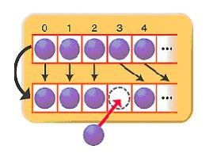

# List

## ArrayList 와 LinkedList

- __ArrayList__
  - 내부적으로 데이터를 배열에서 관리하며 데이터의 추가, 삭제를 위해 아래와 같이 `임시 배열을 생성해 데이터를 복사 하는 방법`을 사용 하고 있다.
  - 
  - 각 데이터는 인덱스를 가지고 있기 때문에 데이터의 `검색`에 유리하다.
    - 데이터 검색 시 (Ex. get(index)) 시간 복잡도는 `O(1)` 이다.
    - 반면, LinkedList 는 검색 시 모든 요소를 탐색해야 하기 때문에 최악의 경우 `O(N)`이다. 
- __LinkedList__
  - 데이터를 저장하는 각 노드가 이전 노드와 다음 노드의 상태만 알고 있다고 보면 된다.
  - 
  - 데이터의 `삽입, 삭제`에 유리 
    - 이전 노드와 다음 노드를 참조하는 상태만 변경하면 되기 때문이다. 
    - 삽입, 삭제시 시간 복잡도는 `O(1)`이다.
    - 반면, ArrayList 는 삽입, 삭제 이후 다른 데이터를 복사해야 하기 때문에 최악의 경우 `O(N)`이다.

## References

> https://www.holaxprogramming.com/2014/02/12/java-list-interface/
