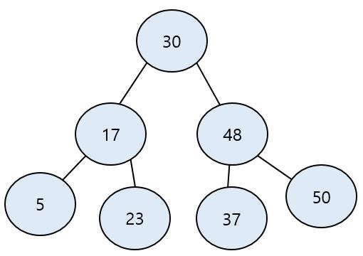

# 순차 탐색(Sequential Search)

순차 탐색이란 __리스트 안에 있는 특정한 데이터를 찾기 위해 앞에서부터 데이터를 하나씩 차례대로 확인하는 방법__ 이다. 보통 정렬되지 않은 리스트에서 데이터를 찾아야할 때 사용하며, 리스트 내에 데이터가 아무리 많아도 시간만 충분하면 결과를 찾을 수 있다.

## 구현

```java
/**
 * @param n 입력 데이터 개수
 * @param target 찾고자 하는 문자열
 * @param arr 배열
 */
public static int sequantialSearch(int n, String target, String[] arr) {
    // 각 원소를 하나씩 확인하며
    for (int i = 0; i < n; i++) {
        // 현재의 원소가 찾고자 하는 원소와 동일한 경우
        if (arr[i].equals(target)) {
            return i + 1; // 현재의 위치 반환 (인덱스는 0부터 시작하므로 1 더하기)
        }
    }
    return -1; // 원소를 찾지 못한 경우 -1 반환
}
```

- __시간 복잡도__
 - `O(N)`
 - 최악의 경우에는 데이터 개수가 N 개일 때 N 번의 비교 연산이 필요하기 때문이다.
 
# 이분 검색(이진 탐색, Binary Search)

이분 검색은 __말 그대로 반으로 쪼개서 찾고자 하는 값이 해당되지 않는 범위는 날리고, 다시 쪼개진 반에서 이분 검색을 실시한다. 이분 검색을 실시하기전에 오름차순 정렬이 되어있어야 한다.__

- __특징__
  - 탐색 범위를 반으로 좁혀가면서 탐색 
  - 탐색을 실시하기전에 `오름차순 정렬`이 되어있어야 한다.
  - 입력 데이터 개수의 범위가 1,000 만을 넘어가면 이진 탐색 혹은 `O(logN)` 의 속도를 내야 하는 알고리즘을 떠올려야 한다.
  - 위치를 나타내는 변수 3개 사용 : `시작점(startPoint = 0), 끝점(endPoint = n-1), 중간점(middlePoint)`
    - 각 Point 들은 값이 아닌 배열의 `Index` 를 나타낸다.
  - 이진 탐색은 데이터를 절 반씩 줄여가면서 탐색하기 때문에 시간 복잡도는 `O(logN)` 이다.
  
- __절차__
   1. 배열을 오름차순으로 정렬 (정렬이 안되어있다 가정) : `Arrays.sort(arr);`
   2. 시작점, 끝점 초기화
   3. 중간점 계산식 : `middlePoint = (startPoint + endPoint) / 2;`
      - 중간점(middlePoint)이 실수일 경우에는 소수점을 버린다. (Ex. (0 + 3) / 2  -> middlePoint = 1)
   4. 중간점과 찾고자 하는 값(target)을 비교한다.
   5. 찾고자 하는 데이터가 더 작은 쪽에 속하면 끝점 index 를 감소 : `endPoint = middlePoint - 1;`
   6. 찾고자 하는 데이터가 더 큰 쪽에 속하면 시작점 index 를 증가 : `startPoint = middlePoint + 1;`
   7. 2번 또는 3번을 수행하고나서 1번(중간점 계산식)을 수행. 즉, 중간점을 다시 계산
 - `찾으려는 데이터와 중간점(Middle) 위치에 있는 데이터를 반복적으로 비교` 해서 원하는 데이터를 찾는 과정

"이진 탐색에 대한 구현은 `손 코딩`으로도 나올만한 문제라고 합니다. 따라서 `절차`를 잘 기억하고 있어야 합니다."

## 구현

### while 문으로 구현하기

```java
private static int n; // 입력 데이터 개수
private static int[] arr; // 탐색 대상인 배열
private static int target; // 찾고자 하는 값

public static int solution() {
  // 찾고자 하는 값의 위치
  int targetIndex = 0;

  // 시작점, 끝점 초기화
  int startPoint = 0;
  int endPoint = n - 1;
  
  // 배열 오름차순 정렬
  Arrays.sort(arr);
  
  // endPoint 의 index 가 더 크거나 같을 때 까지 반복
  while(startPoint <= endPoint) {
        // 중간점 계산
        // while 문 안에 선언하는 이유는 아래에서 startPoint 와 endPoint 의 인덱스 변화가 있을때 다시 계산하기 위함이다.
        int middlePoint = (startPoint + endPoint) / 2;

        // 중간점이 target 값과 동일한 경우    
        if(arr[middlePoint] == target) { 
           targetIndex = middlePoint; // 문제에 따라서 위치 번호를 출력하라고 하면 middlePoint + 1 이 될 수도 있음.
           break;
        }

        // 찾고자 하는 데이터가 더 작은 쪽에 속하면 끝점 index 를 감소
        if(arr[middlePoint] < target) {  
           endPoint = middlePoint - 1;
        } 
        // 찾고자 하는 데이터가 더 큰 쪽에 속하면 시작점 index 를 증가
        else {
           startPoint = middlePoint + 1;
        }
  }
  
  return targetIndex;
}
```

### 재귀로 구현하기

재귀는 사실 별로 추천하지 않는다. 현업에서도 재귀를 쓸일이 많이 없으며, 쓴다하더라도 `재귀의 늪`에 빠질 수 있기 때문에 가급적 추천안한다.
또한, 재귀를 쓴다고하면 재귀를 쓴 이유부터해서 트집잡을게 많아진다고 생각한다.

```java
// 이진 탐색 소스코드 구현(재귀 함수)
public static int binarySearch(int[] arr, int target, int start, int end) {
    if (start > end) return -1;
    int mid = (start + end) / 2;
    // 찾은 경우 중간점 인덱스 반환
    if (arr[mid] == target) return mid;
    // 중간점의 값보다 찾고자 하는 값이 작은 경우 왼쪽 확인
    else if (arr[mid] > target) return binarySearch(arr, target, start, mid - 1);
    // 중간점의 값보다 찾고자 하는 값이 큰 경우 오른쪽 확인
    else return binarySearch(arr, target, mid + 1, end);
}
```

## 이진 탐색 트리(Binary Search Tree)

트리 자료구조는 그래프 자료구조의 일종으로 데이터베이스 시스템이나 파일 시스템과 같은 곳에서 많은 양의 데이터를 관리하기 위한 목적으로 사용한다.

- __트리 자료구조 특징__
    - 트리는 부모 노드와 자식 노드의 관계로 표현된다.
    - 트리의 최상단 노드를 루트 노드(root node)라고 한다.
    - 트리의 최하단 노드를 단말 노드(leaf node)라고 한다.
    - 트리에서 일부를 떼어내도 트리 구조이며, 이를 서브 트리(sub tree)라고 한다.
    - 트리는 파일 시스템과 같이 계층적이고 정렬된 데이터를 다루기에 효과적이다.

큰 데이터를 처리하는 소프트웨어는 대부분 데이터를 트리 자료구조로 저장해서 이진 탐색과 같은 탐색 기법을 사용하여 빠르게 탐색이 가능하다.

이진 탐색 트리는 트리 자료구조 중에서 가장 간단한 트리이다.

- __이진 탐색 트리의 특징__
    - 부모 노드보다 왼쪽 자식 노드가 작다.
    - 부모 노드보다 오른쪽 자식 노드가 크다.
    - 이진 탐색 트리 자료구조를 구현하라고하는 문제는 출제 빈도가 낮다.



찾고자 하는 값이 `37`이면 30 기준으로 이진 탐색을 실시하면 된다. 일단 루트 노드보다 찾고자하는 값이 크므로 왼쪽을 날리고, 오른쪽 그래프에서 다시 이진 탐색을 실시한다.

# 기본 문제

## [이분 검색](https://github.com/BAEKJungHo/algorithms/blob/master/src/src/main/java/inflearn/sorting/binarysearch/Main.java)

```java
/**
 * # 이분 검색(Binary Search)
 *
 * 설명
 * 임의의 N개의 숫자가 입력으로 주어집니다. N개의 수를 오름차순으로 정렬한 다음 N개의 수 중 한 개의 수인 M이 주어지면
 * 이분검색으로 M이 정렬된 상태에서 몇 번째에 있는지 구하는 프로그램을 작성하세요. 단 중복값은 존재하지 않습니다.
 *
 * 입력
 * 첫 줄에 한 줄에 자연수 N(3<=N<=1,000,000)과 M이 주어집니다.
 * 두 번째 줄에 N개의 수가 공백을 사이에 두고 주어집니다.
 *
 * 출력
 * 첫 줄에 정렬 후 M의 값의 위치 번호를 출력한다.
 *
 * 예시 입력 1
 * 8 32
 * 23 87 65 12 57 32 99 81
 *
 * 예시 출력 1
 * 3
 */
 ```

```java
// Binary Search
public int solution(int n, int m, int[] arr) {
    int answer = 0;
    Arrays.sort(arr);
    int lt = 0, rt = n-1;
    while(lt <= rt){
        int mid = (lt + rt) / 2;
        if(arr[mid] == m) {
            answer = mid + 1;
            break;
        }
        if(arr[mid] > m) rt = mid - 1; // 찾고자하는 값이 더 작은 쪽에 있다면 검색범위 큰 쪽을 아예 날린다. = mid - 1;
        else lt = mid + 1; // 찾고자하는 값이 더 큰 쪽에 있다면 검색범위 작은 쪽을 아예 날린다.
    }
    return answer;
}
```

# 결정 알고리즘

## [뮤직비디오(결정알고리즘)](https://github.com/BAEKJungHo/algorithms/blob/master/src/src/main/java/inflearn/searching/musicvideo/Main.java)

```
 * 설명
 * 지니레코드에서는 불세출의 가수 조영필의 라이브 동영상을 DVD로 만들어 판매하려 한다.
 * DVD에는 총 N개의 곡이 들어가는데, DVD에 녹화할 때에는 라이브에서의 순서가 그대로 유지되어야 한다.
 * 순서가 바뀌는 것을 우리의 가수 조영필씨가 매우 싫어한다. 즉, 1번 노래와 5번 노래를 같은 DVD에 녹화하기 위해서는
 * 1번과 5번 사이의 모든 노래도 같은 DVD에 녹화해야 한다. 또한 한 노래를 쪼개서 두 개의 DVD에 녹화하면 안된다.
 * 지니레코드 입장에서는 이 DVD가 팔릴 것인지 확신할 수 없기 때문에 이 사업에 낭비되는 DVD를 가급적 줄이려고 한다.
 * 고민 끝에 지니레코드는 M개의 DVD에 모든 동영상을 녹화하기로 하였다. 이 때 DVD의 크기(녹화 가능한 길이)를 최소로 하려고 한다.
 * 그리고 M개의 DVD는 모두 같은 크기여야 제조원가가 적게 들기 때문에 꼭 같은 크기로 해야 한다.
```

- 입력
  - 첫째 줄에 자연수 N(1≤N≤1,000), M(1≤M≤N)이 주어진다.
  - 다음 줄에는 조영필이 라이브에서 부른 순서대로 부른 곡의 길이가 분 단위로(자연수) 주어진다.
  - 부른 곡의 길이는 10,000분을 넘지 않는다고 가정하자.
  - Ex. 1 2 3 4 5 6 7 8 9
- 출력 : 첫 번째 줄 부터 DVD 의 최소 용량 크기를 출력하세요.

결정(Decision) 알고리즘은 `이분 검색(Binary Search)`을 사용하는데, `<-lt---------------rt->` 범위 안에 정답이 있는 경우에 사용한다. 위 문제에서 요구하는 정답은 `DVD 의 최소 용량 크기`이다.

lt 가 1 이고 rt 가 10000 이라고 할 때 이분검색을 하면 중앙은 5000 이 된다. 5000 이라는 값안에 DVD 의 최소 용량 크기가 무조건 포함된다. 물론 5000 은 답에 비해 너무 큰 값이지만 어쨋든 포함이 된다는 것이 중요하다.

위 문제 입력 예시 `1 2 3 4 5 6 7 8 9` 기준으로 lt, rt 값을 정하면 lt 는 9가 되며, rt 는 45가된다.

```java
// 두 말의 최대 거리(dist)를 기준으로 배치할 수 있는 말의 마리 수
public int count(int[] arr, int dist){
    int cnt=1;
    int endPosition=arr[0];
    for(int i=1; i<arr.length; i++){
        if(arr[i]-endPosition>=dist){
            cnt++;
            endPosition=arr[i];
        }
    }
    return cnt; // 배치한 말의 마리 수
}

/**
 * @param n 배열 크기
 * @param c 배치하고싶은 말의 마리 수
 * @param arr 마구간 좌표
 */
public int solution(int n, int c, int[] arr){
    int answer=0;
    Arrays.sort(arr); // 마구간 좌표 오름차순 정렬
    int lt=1;
    int rt=arr[n-1]; // 마지막 인덱스 값
    while(lt<=rt){
        int mid=(lt+rt)/2; // 두 말의 최대 거리
        if(count(arr, mid)>=c){ // 배치한 말의 마리수 >= 배치 하고 싶은 말의 마리 수
            answer=mid;
            lt=mid+1;
        }
        else rt=mid-1;
    }
    return answer;
}
```

## [마구간 정하기](https://github.com/BAEKJungHo/algorithms/blob/master/src/src/main/java/inflearn/searching/decisionstable/Main.java)

```java
// 두 말의 최대 거리(dist)를 기준으로 배치할 수 있는 말의 마리 수
public int count(int[] arr, int dist){
    int cnt=1;
    int endPosition=arr[0];
    for(int i=1; i<arr.length; i++){
        if(arr[i]-endPosition>=dist){
            cnt++;
            endPosition=arr[i];
        }
    }
    return cnt; // 배치한 말의 마리 수
}

/**
 * @param n 배열 크기
 * @param c 배치하고싶은 말의 마리 수
 * @param arr 마구간 좌표
 */
public int solution(int n, int c, int[] arr){
    int answer=0;
    Arrays.sort(arr); // 마구간 좌표 오름차순 정렬
    int lt=1;
    int rt=arr[n-1]; // 마지막 인덱스 값
    while(lt<=rt){
        int mid=(lt+rt)/2; // 두 말의 최대 거리
        if(count(arr, mid)>=c){ // 배치한 말의 마리수 >= 배치 하고 싶은 말의 마리 수
            answer=mid;
            lt=mid+1;
        }
        else rt=mid-1;
    }
    return answer;
}
```
