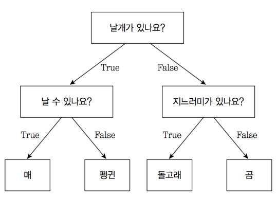
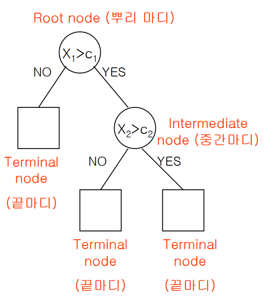

# 이분 검색

Point. __이분 검색은 말 그대로 반으로 쪼개서 찾고자 하는 값이 해당되지 않는 범위는 날리고, 다시 쪼개진 반에서 이분 검색을 실시한다.__

## 🔑 [이분 검색](https://github.com/BAEKJungHo/algorithms/blob/master/src/src/main/java/inflearn/sorting/binarysearch/Main.java)

```java
/**
 * # 이분 검색(Binary Search)
 *
 * 설명
 * 임의의 N개의 숫자가 입력으로 주어집니다. N개의 수를 오름차순으로 정렬한 다음 N개의 수 중 한 개의 수인 M이 주어지면
 * 이분검색으로 M이 정렬된 상태에서 몇 번째에 있는지 구하는 프로그램을 작성하세요. 단 중복값은 존재하지 않습니다.
 *
 * 입력
 * 첫 줄에 한 줄에 자연수 N(3<=N<=1,000,000)과 M이 주어집니다.
 * 두 번째 줄에 N개의 수가 공백을 사이에 두고 주어집니다.
 *
 * 출력
 * 첫 줄에 정렬 후 M의 값의 위치 번호를 출력한다.
 *
 * 예시 입력 1
 * 8 32
 * 23 87 65 12 57 32 99 81
 *
 * 예시 출력 1
 * 3
 */
 ```

```java
// Binary Search
public int solution(int n, int m, int[] arr) {
    int answer = 0;
    Arrays.sort(arr);
    int lt = 0, rt = n-1;
    while(lt <= rt){
        int mid = (lt + rt) / 2;
        if(arr[mid] == m) {
            answer = mid + 1;
            break;
        }
        if(arr[mid] > m) rt = mid - 1; // 찾고자하는 값이 더 작은 쪽에 있다면 검색범위 큰 쪽을 아예 날린다. = mid - 1;
        else lt = mid + 1; // 찾고자하는 값이 더 큰 쪽에 있다면 검색범위 작은 쪽을 아예 날린다.
    }
    return answer;
}
```

# 결정 트리 알고리즘(Decision Tree Algorithm)

결정 트리는 `의사결정트리` 혹은 `의사결정나무`라고도 한다. 분류(Classification)와 회귀(Regression) 모두 가능한 지도 학습 모델 중 하나이다.

결정 트리는 스무고개 하듯이 예/아니오 질문을 이어가며 학습합니다.



이렇게 특정 기준(질문)에 따라 데이터를 구분하는 모델을 결정 트리 모델이라고 합니다. 한번의 분기 때마다 변수 영역을 두 개로 구분합니다. 결정 트리에서 질문이나 정답을 담은 네모 상자를 노드(Node)라고 합니다. 맨 처음 분류 기준 (즉, 첫 질문)을 `Root Node` 라고 하고, 맨 마지막 노드를 `Terminal Node` 혹은 `Leaf Node` 라고 합니다.



## References

> https://bkshin.tistory.com/entry/%EB%A8%B8%EC%8B%A0%EB%9F%AC%EB%8B%9D-4-%EA%B2%B0%EC%A0%95-%ED%8A%B8%EB%A6%ACDecision-Tree
