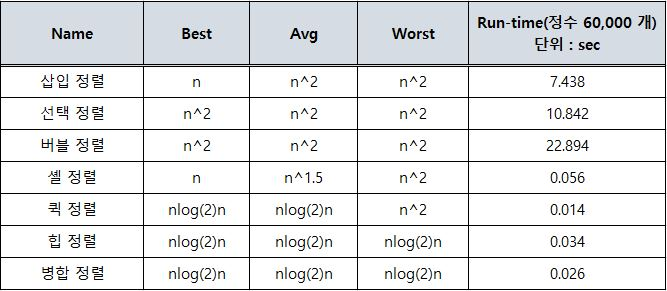

# 정렬(Sorting)



# 선택 정렬(Selection Sort)

Point. 최솟값을 찾아 정렬되지 않은 가장 앞에 존재하는 원소와 교체(swap)하는 알고리즘 : `1회전마다 최솟값을 앞으로 보내는 알고리즘`

- __제자리 정렬(in-place sorting) 알고리즘의 하나__
  - 입력 배열(정렬되지 않은 값들) 이외에 다른 추가 메모리를 요구하지 않는 정렬 방법
- __해당 순서에 원소를 넣을 위치는 이미 정해져 있고, 어떤 원소를 넣을지 선택하는 알고리즘__
  - 첫 번째 순서에는 첫 번째 위치에 가장 최솟값을 넣는다.
  - 두 번째 순서에는 두 번째 위치에 남은 값중에서의 최솟값을 넣는다.
- __과정 설명__
  1. 주어진 배열 중에서 최솟값을 찾는다.
  2. 그 값을 맨 앞에 위치한 값과 교체한다(패스(pass))
  3. 맨 처음 위치를 뺀 나머지 리스트를 같은 방법으로 교체한다.
  4. 하나의 원소만 남을 때까지 위의 과정을 반복한다.
- __구체적인 개념__
  - 선택 정렬은 첫 번째 자료를 두 번째 자료부터 마지막 자료까지 차례대로 비교하여 `가장 작은 값(최솟값)`을 찾아 첫 번째에 놓고, 두 번째 자료를 세 번째 자료부터 마지막 자료까지와 차례대로 비교하여 그 중 가장 작은 값을 찾아 두 번째 위치에 놓는 과정을 반복하며 정렬을 수행한다.

## 구현

```java
// 정렬 코드의 가장 큰 특징 중 하나가 교체(swap) 코드를 잘 기억해야 함
// 선택정렬 : 최솟값을 찾아서 정렬 되지 않은 가장 앞의 인덱스랑 교체
public int[] solution(int[] arr) {
    for(int i=0; i<arr.length-1; i++) {
        int tmp = arr[i];
        for(int k=i+1; k<arr.length; k++) {
            if(tmp > arr[k]) {
                tmp = arr[k];
                arr[k] = arr[i];
                arr[i] = tmp;
            }
        }
    }
    return arr;
}
```

# 버블 정렬(Bubble Sort)

Point. 서로 인접한 두 원소를 검사하여 정렬하는 알고리즘 : `1회전 마다 최댓값을 맨 뒤로 보내는 알고리즘`

- __서로 인접한(adjacent) 두 원소를 검사하여 정렬하는 알고리즘__
   - 인접한 2개의 레코드를 비교하여 크기가 순서대로 되어 있지 않으면 교환한다.
   - 선택 정렬과 기본 개념이 유사하다.
- __구체적인 개념__
  - 버블 정렬은 첫 번째 자료와 두 번째 자료를, 두 번째 자료와 세 번째 자료를, 세 번째와 네 번째를, … 이런 식으로 (마지막-1)번째 자료와 마지막 자료를 비교하여 교환하면서 자료를 정렬한다.
  - `1회전을 수행하고 나면 가장 큰 자료가 맨 뒤로 이동`하므로 2회전에서는 맨 끝에 있는 자료는 정렬에서 제외되고, 2회전을 수행하고 나면 끝에서 두 번째 자료까지는 정렬에서 제외된다. 이렇게 정렬을 1회전 수행할 때마다 정렬에서 제외되는 데이터가 하나씩 늘어난다.

## 구현

```java
public int[] solution(int[] arr) {
    // arr.length = n
    for(int i=0; i<arr.length-1; i++) { // 바깥 반복문은 n-1 회 만큼 반복
        for(int k=0; k<arr.length-i-1; k++) { // 1회전하면 마지막 원소는 정렬이 되었으므로 n-i-1
            if(arr[k] > arr[k+1]) {
                int tmp = arr[k];
                arr[k] = arr[k+1];
                arr[k+1] = tmp;
            }
        }
    }
    return arr;
}
```

# 삽입 정렬(Insertion Sort)

Point. 첫 인덱스 값은 이미 정렬된 것으로 보고, 2 번째 자료 부터 정렬을 시작한다. : `1회전 마다 자기 앞에 있는 자료들과 비교하는 알고리즘`

- 자료 배열의 모든 요소를 앞에서부터 차례대로 이미 정렬된 배열 부분과 비교 하여, 자신의 위치를 찾아 삽입함으로써 정렬을 완성하는 알고리즘
- 매 순서마다 해당 원소를 삽입할 수 있는 위치를 찾아 해당 위치에 넣는다.
- __구체적인 개념__
  - 삽입 정렬은 두 번째 자료부터 시작하여 그 앞(왼쪽)의 자료들과 비교하여 삽입할 위치를 지정한 후 자료를 뒤로 옮기고 지정한 자리에 자료를 삽입하여 정렬하는 알고리즘이다.
  - 즉, 두 번째 자료는 첫 번째 자료, 세 번째 자료는 두 번째와 첫 번째 자료, 네 번째 자료는 세 번째, 두 번째, 첫 번째 자료와 비교한 후 자료가 삽입될 위치를 찾는다. 자료가 삽입될 위치를 찾았다면 그 위치에 자료를 삽입하기 위해 자료를 한 칸씩 뒤로 이동시킨다.
  - `처음 Key 값은 두 번재 자료부터 시작한다.`

## 특징

- __장점__
  - 안정적인 정렬 방법
  - 레코드의 수가 적을 수록 알고리즘 자체가 매우 간단하므로 다른 복잡한 정렬 방법보다 유리할 수 있다.
  - 레코드가 이미 정렬되어 있는 경우에 매우 효율적일 수 있다.
- __단점__
  - 비교적 많은 레코드들의 이동을 포함한다.
  - 레코드 수가 많고 레코드 크기가 클 경우에 적합하지 않다.

## 구현

```java
public int[] solution(int[] arr) {
  int key;

  // 인덱스 0은 이미 정렬된 것으로 볼 수 있다.
  for(int i=1; i<arr.length; i++) { // 바깥 반복문은 삽입될 숫자들에 대한 반복문 (즉, 첫 인덱스를 제외한 n-1 만큼 반복)
      key = arr[i]; // 현재 삽입될 숫자인 i번째 정수를 key 변수로 복사

      // 현재 정렬된 배열은 i-1까지이므로 i-1번째부터 역순으로 조사한다.
      // k 값은 음수가 아니어야 되고
      // key 값보다 정렬된 배열에 있는 값이 크면 k 번째를 k+1 번째로 이동
      for(int k=i-1; k>=0; k--) { // 내부 반복문은 자기 바로 앞에 존재하는 자료들과 비교
          if(arr[k] > key) {
              key = arr[k+1];
              arr[k+1] = arr[k];
              arr[k] = key;
          }
      }
  }
  return arr;
}
```

### [LRU(Least Recently Used)](https://github.com/BAEKJungHo/algorithms/blob/master/src/src/main/java/inflearn/sorting/lru/Main.java)

```java
// 삽입정렬 응용 문제 -> list.set(2, 5) 이런식으로 할 순있지만 직접 구현하는게 더 좋음
// 손 코딩으로도 나올 수 있는 문제
public int[] solution(int cacheSize, int[] arr) {
    int[] cache = new int[cacheSize];
    for(int x : arr) { // 작업 번호 반복
        int position = -1;
        for(int i=0; i<cacheSize; i++) {
            if (x == cache[i]) { // 작업 번호가 cache 안에 있는 경우
                position = i; // 해당 인덱스를 설정
            }
        }
        if(isCacheMiss(position)) { // cache miss -> 새로들어갈원소의 맨 앞 인덱스 0 을 제외하고 값을 한 칸씩 뒤로 이동
            for(int i=cacheSize-1; i>=1; i--) {
                cache[i] = cache[i-1];
            }
        } else { // cache hit
            for(int i=position; i>=1; i--) { // 설정된 인덱스 부터 맨 앞 인덱스 0 을 제외하고 값을 한 칸씩 뒤로 이동
                cache[i] = cache[i-1];
            }
        }
        cache[0] = x; // 현재 작업 번호는 항상 맨 앞에 삽입
    }
    return cache;
}
```

## 🔑 기본 문제

### [중복 확인](https://github.com/BAEKJungHo/algorithms/blob/master/src/src/main/java/inflearn/sorting/checkduplicate/Main.java)

```java
public String solution(int[] arr) {
    Queue<Integer> Q = new LinkedList<>();
    for(int i=0; i<arr.length; i++) {
        if(Q.contains(arr[i])) {
            return "D";
        }
        Q.offer(arr[i]);
    }
    return "U";
}

// 정렬 후 인접한 두 원소 끼리 비교
public String solution(int n, int[] arr){
    String answer="U";
    Arrays.sort(arr);
    for(int i=0; i<n-1; i++){
        if(arr[i] == arr[i+1]){
            answer="D";
            break;
        }
    }
    return answer;
}
```

### [장난꾸러기](https://github.com/BAEKJungHo/algorithms/blob/master/src/src/main/java/inflearn/sorting/mischievous/Main.java)

```java
public ArrayList<Integer> solution(int[] arr) {
    ArrayList<Integer> answer=new ArrayList<>();
    int[] tmp = arr.clone();
    Arrays.sort(tmp);
    for(int i=0; i<arr.length; i++){
        if(arr[i] != tmp[i]) {
            answer.add(i+1);
        }
    }
    return answer;
}
```

### [좌표 정렬](https://github.com/BAEKJungHo/algorithms/blob/master/src/src/main/java/inflearn/sorting/coordinatesort/Main.java)

- Point
  - Comparable 을 사용한 객체 정렬

```java
class Coordinate implements Comparable<Coordinate> {
    private int x;
    private int y;

    public Coordinate(int x, int y) {
        this.x = x;
        this.y = y;
    }

    public int getX() {
        return x;
    }

    public int getY() {
        return y;
    }

    @Override
    public String toString() {
        return this.x + " " + this.y;
    }

    @Override
    public int compareTo(Coordinate o) {
        if(this.x == o.x) {
            return this.y-o.getY();
        } else {
            return this.x- o.getX();
        }
    }
}

public class Main {

    public List<Coordinate> solution(List<Coordinate> coordinates) {
        coordinates.sort(Coordinate::compareTo);
        return coordinates;
    }

    public static void main(String[] args) {
        Main T = new Main();
        Scanner sc = new Scanner(System.in);
        int n = sc.nextInt();
        List<Coordinate> coordinates = new ArrayList<>();
        for(int i=0; i<n; i++) {
            int x = sc.nextInt();
            int y = sc.nextInt();
            coordinates.add(new Coordinate(x, y));
        }
        for(Coordinate coordinate : T.solution(coordinates)) {
            System.out.println(coordinate.toString());
        }
    }

}
```

## 🔑 [이분 검색](https://github.com/BAEKJungHo/algorithms/blob/master/src/src/main/java/inflearn/sorting/binarysearch/Main.java)

```java
/**
 * # 이분 검색(Binary Search)
 *
 * 설명
 * 임의의 N개의 숫자가 입력으로 주어집니다. N개의 수를 오름차순으로 정렬한 다음 N개의 수 중 한 개의 수인 M이 주어지면
 * 이분검색으로 M이 정렬된 상태에서 몇 번째에 있는지 구하는 프로그램을 작성하세요. 단 중복값은 존재하지 않습니다.
 *
 * 입력
 * 첫 줄에 한 줄에 자연수 N(3<=N<=1,000,000)과 M이 주어집니다.
 * 두 번째 줄에 N개의 수가 공백을 사이에 두고 주어집니다.
 *
 * 출력
 * 첫 줄에 정렬 후 M의 값의 위치 번호를 출력한다.
 *
 * 예시 입력 1
 * 8 32
 * 23 87 65 12 57 32 99 81
 *
 * 예시 출력 1
 * 3
 */
 ```

```java
// Binary Search
public int solution(int n, int m, int[] arr) {
    int answer = 0;
    Arrays.sort(arr);
    int lt = 0, rt = n-1;
    while(lt <= rt){
        int mid = (lt + rt) / 2;
        if(arr[mid] == m) {
            answer = mid + 1;
            break;
        }
        if(arr[mid] > m) rt = mid - 1; // 찾고자하는 값이 더 작은 쪽에 있다면 검색범위 큰 쪽을 아예 날린다. = mid - 1;
        else lt = mid + 1; // 찾고자하는 값이 더 큰 쪽에 있다면 검색범위 작은 쪽을 아예 날린다.
    }
    return answer;
}
```

## Reference

> https://gmlwjd9405.github.io
