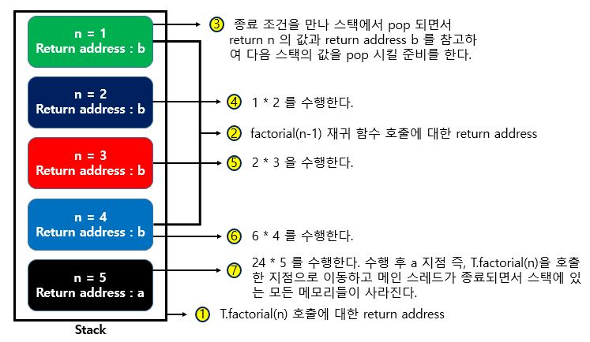

# 재귀 함수(Recursive Function)

재귀 함수(Recursive Function)란 자기 자신을 다시 호출하는 함수를 의미한다.

```java
public class Main {

    public static void recursiveFunction() {
        System.out.println("재귀 함수를 호출합니다.");
        recursiveFunction();
    }

    public static void main(String[] args) {
        recursiveFunction();
    }
}
```

재귀 함수는 종료 조건이 무조건 있어야 한다. 그렇지 않으면 무한 루프에 빠질 수 있다.

```java
public class Main {

    public static void recursiveFunction(int i) {
        // 100번째 호출을 했을 때 종료되도록 종료 조건 명시
        if (i == 100) return;
        System.out.println(i + "번째 재귀 함수에서 " + (i + 1) + "번째 재귀함수를 호출합니다.");
        recursiveFunction(i + 1);
        System.out.println(i + "번째 재귀 함수를 종료합니다.");
    }

    public static void main(String[] args) {
        recursiveFunction(1);
    }
}
```

재귀 함수는 내부적으로 [스택(Stack)](https://github.com/BAEKJungHo/algorithms/tree/master/contents/DataStructures/Stack)을 이용한다. 함수를 계속 호출했을 때 가장 마지막에 호출한
함수가 먼저 수행을 끝내야 그 앞의 함수 호출이 종료되기 때문이다.

컴퓨터 구조 측면에서 보자면 연속해서 호출되는 함수는 메인 메모리의 [스택 공간](https://webdevtechblog.com/jvm-java-virtual-machine-architecture-94b914e93d86)에 적재되므로, 재귀 함수는 스택 자료구조와 같다는 말은 틀린 말이 아니다.

> 메서드를 호출할 때마다 스택이 개별적으로 생성된다.

재귀 함수를 이용하는 대표적인 예제로는 `팩토리얼(Factorial)` 문제가 있다.

> 팩토리얼(Factorial) : n! > 1 x 2 x 3 x ... x (n-1) x n

수학적으로 `0!` 과 `1!`은 1로 같다는 성질을 이용하여 n 이 1 이하가 되었을 때 함수를 종료하는 재귀 함수의 형태로 구현할 수 있다.

## 팩토리얼(Factorial)

```java
public class Main {

    // 반복적으로 구현한 n!
    public static int factorialIterative(int n) {
        int result = 1;
        // 1부터 n까지의 수를 차례대로 곱하기
        for (int i = 1; i <= n; i++) {
            result *= i;
        }
        return result;
    }

    // 재귀적으로 구현한 n!
    public static int factorialRecursive(int n) {
        // n이 1 이하인 경우 1을 반환
        if (n <= 1) return 1;
        // n! = n * (n - 1)!를 그대로 코드로 작성하기
        return n * factorialRecursive(n - 1);
    }

    public static void main(String[] args) {
        // 각각의 방식으로 구현한 n! 출력(n = 5)
        System.out.println("반복적으로 구현:" + factorialIterative(5));
        System.out.println("재귀적으로 구현:" + factorialRecursive(5));
    }
}
```

재귀 함수를 사용했을 때의 장점은 `코드가 더 간결`해진다는 것이다. 이렇게 간결해진 이유는 재귀 함수가 수학의 `점화식(재귀식)`을 그대로 소스코드로 옮겼기 때문이다. 수학에서 점화식은
특정한 함수를 자신보다 더 작은 변수에 대한 함수와의 관계로 표현한 것을 의미한다. 이 개념은 `다이나믹 프로그래밍`을 배울 때 중요하다. 즉, 재귀를 사용할 생각이라면 `점화식으로 표현할 수 있는지`를 생각해보는 것이 좋다.

- __Factorial 점화식__
  - n 이 0이거나 1일때 : factorial(n) = 1
  - n 이 1보다 클 때 : factorial(n) = n x factorial(n-1)  

## 스택(Stack)과 재귀(Recursive)

재귀(Recursive)를 제대로 이해하는 것은 마냥 쉽진 않다. 일단 재귀가 스택(Stack)으로 동작한다는 것을 설명하기 위해 `Factorial` 구현을 예시로 들었다.

```java
public class Recursive {

     public int factorial(int n) {
        System.out.println(Thread.currentThread().getName()); // 현재 실행중인 스레드 이름
        return n <= 1 ? 1 : n * factorial(n-1);
    }

    public static void main(String[] args) {
        Recursive T = new Recursive();
        Scanner sc = new Scanner(System.in);
        int n = sc.nextInt();
        System.out.println(T.factorial(n));
    }
}
```

자, 재귀가 스택으로 동작한다는 것을 이해하기 위해선 다음과 같은 내용에 대해서 이해하고 있어야 한다.

- __JVM 메모리 스택 영역__
    - 자바에서는 `스레드가 생성 될 때 마다` 스택 영역이 개별적으로 생성된다. 
    - 스레드가 메서드 호출 시, 지역변수, 매개변수 등이 저장된다.
    - Heap 영역에 생성된 `Object 타입 | 데이터` 의 참조 변수(Reference Variable)가 할당된다.
        - Ex. String ref = "abc";
        - 실제로 Heap 영역에는 String | "abc" 이런식으로 들어가고, ref 의 참조 변수가 stack 에 할당된다. 
    - 원시 타입의 데이터가 값과 함께 할당된다.
    - 지역변수들은 `scope` 에 따른 `visibility` 를 가진다.
    - 가장 마지막에 호출한 함수가 종료 되어야 이 전에 호출한 함수들도 종료가 된다.
- __JVM 메모리 힙 영역__
    - Heap 영역에는 주로 긴 생명주기를 가지는 데이터들이 저장된다. (대부분의 오브젝트는 크기가 크고, 서로 다른 코드블럭에서 공유되는 경우가 많다.)
    - 애플리케이션의 모든 메모리 중 stack 에 있는 데이터를 제외한 부분이라고 보면 된다.
    - 모든 Object 타입(Integer, String, ArrayList, ...)은 heap 영역에 생성된다.
    - 몇개의 스레드가 존재하든 상관없이 단 하나의 heap 영역만 존재한다.
    - Heap 영역에 있는 오브젝트들을 가리키는 레퍼런스 변수가 stack 에 올라가게 된다.
- __스택 자료 구조__
    - LIFO(Last In First Out)
- __Call Frame(Call Stack)__
    - 재귀 함수는 함수가 호출될 때마다 Call Frame(호출 프레임)의 정보들이 스택 메모리에 저장된다.
        - 호출 함수의 `return address`
            - 스택에서 "가장 마지막에 호출한 함수가 종료 되어야 이 전에 호출한 함수들도 종료가 된다." 라고 했다. 호출 함수의 return address 가 있기에 돌아올 위치를 알 수 있는 것이다.
        - 피호출 함수의 `매개변수` 와 `지역변수`

> [자바 스택과 힙 메모리 관리](https://yaboong.github.io/java/2018/05/26/java-memory-management/)

자, 이제 위 코드의 입력(N) 값을 5로 주고 돌려보자.

결과는 다음과 같다. 

```
main 
main
main
main
main
120
```

호출된 재귀 함수들이 현재 main 스레드 위에서 동작하는 것을 볼 수 있다. (즉, 스레드가 현재 1개이다.) 그러면 위에서 배운 개념을 적용하면 생성된 스택 영역도 1개인 것이다.

그림으로 스택과 재귀의 동작 과정을 살펴보자. 

> 그림에서 색깔이 다른 이유는 다른 scope 를 의미한다. 따라서 스택에 n 이 값이 여러개 있더라도 scope 가 다르면 사용할 수 없다.



1. 메인 스레드에 의해 factorial 함수가 호출되었으므로 return address (Ex. a)를 저장하고, 매개변수 n 과 원시 값을 저장한다. (n = 5)
    - 스택 메모리의 특징에서 원시 값은 스택에 저장된다고 배웠다.
    - 여기서 주소 값 a 는 `T.factorial(n)` 이 코드에 대한 주소 값이다.
2. 다음으로 n 이 1이하가 아니므로 재귀 함수가 호출된다.
3. 점화식이 호출되면서 새로운 return address (Ex. b) 값과 매개변수 n 과 원시 값을 저장한다. (n = 4)
    - 여기서 주소 값 b 는 재귀 함수 호출에 대한 주소 값이다.
4. 종료 조건인 `n <= 1` 이 될때 까지 반복하여 스택에 저장한다.
5. 종료 조건을 만나 return 문을 호출하면서, 스택의 top 부분이 pop 되면서 return n 의 값과, return address 를 참고하여 다음 함수 호출 주소로 이동하여 계산할 준비를 한다.
6. 메인 함수가 종료되면서 stack 에 있는 모든 메모리들이 사라진다.


### 재귀 함수의 문제 : Stack Overflow 

재귀 함수는 호출 시 마다 함수의 지역변수, 매개변수, 리턴 후 돌아갈 위치, 리턴 값 등을 스택에 저장한다. 따라서 무리하게 호출을 하다보면 스택 공간이 다 차버리는 `스택 오버플로우(Stack Overflow )`현상이 발생할 수 있다.

# 꼬리 재귀(Tail Recursion)

꼬리 재귀는 재귀 함수의 장점은 살리고, 단점을 보완하는 방법 중 하나이다.

- __꼬리 재귀 최적화를 위한 조건__
    - 재귀 함수를 꼬리 재귀 방식으로 구현할 것
    - 컴파일러가 꼬리 재귀 최적화를 지원할 것

컴파일러가 꼬리 재귀 최적화를 지원하지 않는다면, 꼬리 재귀 방식으로 구현을 해도 일반 재귀 처럼 동작할 것이다.

꼬리 재귀는 `재귀 호출이 끝나면 아무 일도 하지 않고 결과만 바로 반환되도록 하는 방법`이다. 이 방식을 사용하면 이전 함수의 상태를 유지하지도 않고 추가 연산을 하지도 않아서 스택이 넘쳐나는 문제를 해결할 수 있게 된다.

꼬리 재귀 함수는 이름처럼 항상 함수의 꼬리부분(마지막)에서 실행되는데, return 되기 전에 값이 정해지며 `호출당한 함수의 결과값이 → 호출하는 함수의 결과값` 으로 반환된다.

- __꼬리 재귀__
    - 호출 당한 함수의 결과 > 호출한 함수의 결과

일반 재귀 방식의 코드를 다시 보자.

```java
public int factorial(int n) {
    return n <= 1 ? 1 : n * factorial(n-1);
}
```

일반적인 재귀의 경우 factorial(3)을 호출 했다고 하면 마지막에 호출된 재귀 함수 값이 1이면 그 값을 다음 스택에 넘겨서 `2 * 1`을 계산하게 하고, 그 결과를 또 다음 스택에 넘겨서 `3 * 2` 를 계산하게하여 결과를 도출한다. 일반 재귀의 마지막 부분은 아래처럼 생겼었다. `factorial(n-1)` 이 바로 호출당한 함수인데, 이 함수는 스택에 쌓였다가 빠져 나올 때 원래 자기 자리로 돌아가서 앞쪽의 n 과 곱해져야 한다. 즉, return address 가 필수이다.

위 코드에 대한 컴파일러의 해석은 동일하게 재귀 방식이다.

```java
public int factorial(int n) {
    return n <= 1 ? 1 : n * this.factorial(n - 1);
}
```

다음은 꼬리 재귀 방식이다.

```java
public int factorialTail(int n, int total) {
    return n == 1 ? total : factorialTail(n - 1,  n * total);
}

public int factorial(int n) {
    return factorialTail(n, 1);
}
```

__꼬리 재귀의 핵심은 재귀 호출 이후 추가적인 연산을 요구하지 않도록 구현 하는 것이다.__ 

꼬리 재귀의 마지막 부분을 보면 `factorialTail(n - 1,  n * total)` 따로 연산 같은 작업을 추가로 하지 않고 반환만 한다. 따라서 굳이 자기 자리를 기억하지 않아도 된다. 즉, 스택에 return address 를 저장할 필요가 없어진다.

위 코드에 대한 컴파일러의 해석은 다음과 같다.

```java
int factorialTail(int n) {
    int total = 1;
    do {
    	if(n == 1) return;
        total = total * n;
        n = n - 1;
    } while(true);
}
```

재귀호출은 사라지고, do-while문을 이용하는 코드로 최적화되어 있는 것을 확인할 수 있다. 즉, 내부적으로 `재귀 함수를 반복문으로 변경되어 실행`이 된다. 따라서, Stack Overflow 에 대한 위험이 없다고 하는 것이다.

## Java 와 꼬리 재귀 최적화

C++, C#, Kotlin, Swift 는 꼬리 재귀 최적화를 지원하며, JavaScript 는 ES6 스펙에서 지원한다고 한다.
Scala 는 JVM 위에서 동작하는데, 꼬리 재귀 최적화를 지원한다고 한다.
하지만 Java 는 꼬리 재귀 최적화를 직접적으로 지원하지 않는다.

자바에서 진짜 최적화를 지원하지 않는지 테스트를 해보았다. 컴파일러의 해석 결과는 다음과 같았다.

```java
public static int factorialTail(int n, int total) {
    return n == 1 ? total : factorialTail(n - 1, n * total);
}
```

- [지원하지 않는 이유](http://wiki.sys4u.co.kr/display/SOWIKI/Tail+call+Optimization)
    - jdk 클래스에는 보안에 민감한 메소드가 있다고 한다. 이 메소드들은 메소드 호출을 누가 했는지 알아내기 위해 jdk 라이브러리 코드와 호출 코드간의 스택 프레임 갯수에 의존한다. 스택 프레임 수의 변경을 유발하게 되면 이 의존관계를 망가뜨려 에러가 발생할 수 있다.
- [Java에서 꼬리 재귀 사용하기?](https://blog.knoldus.com/tail-recursion-in-java-8/)
    - Java는 컴파일러 레벨에서는 직접적으로 꼬리 재귀 최적화를 지원하지는 않지만, Java 8의 람다식과 함수형 인터페이스(functional interface)로 꼬리 재귀와 같은 컨셉을 적용해볼 수 있다고 한다.

## Java 8의 람다식과 함수형 인터페이스(functional interface)로 구현

```java
package jungho.chapter5.factorial;

import java.util.Scanner;
import java.util.stream.Stream;

/**
 * TailCalls Convenience Class
 */
class TailCalls {

    public static TailCall call(final TailCall nextCall) {
        return nextCall;
    }

    public static TailCall done(final int value) {
        return new TailCall() {
            @Override
            public boolean isComplete() { // true 를 반환하여 재귀의 끝을 보고한다.
                return true;
            }

            @Override
            public int result() {
                return value;
            }

            @Override
            public TailCall apply() {
                throw new Error("not implemented");
            }
        };
    }
}

/**
 * default 메서드를 이용하여 구현
 */
@FunctionalInterface
interface TailCall {

    // 실행 대기 중인 다음 TailCall 인스턴스를 반환
    TailCall apply();

    // 단순히 false 를 반환 : false 라는 것은 아직 대기중이라는 의미가 된다.
    default boolean isComplete() {
        return false;
    }

    default int result() {
        throw new Error("not implemented");
    }

    default int invoke() {
        return Stream.iterate(this, TailCall::apply)
                .filter(TailCall::isComplete)
                .findFirst()
                .get()
                .result();
    }
}

public class TailRecursiveWithLambda {

    /**
     * factorialTail() 메서드를 호출하면 TailCall 인스턴스와 함께 즉시 반환된다.
     * 핵심 아이디어는 done() 메서드를 호출 하면 재귀가 종료 된다는 신호를 보낸다는 것이다.
     * 반면에 call() 메서드를 사용하는 경우 재귀를 계속하도록 요청하지만 현재 스택 수준에서 한 단계 내려간 후에만 가능하다.
     * @param n 입력값
     * @param total 총 계산한 값
     * @return TailCall
     */
    public static TailCall factorialTail(final int n, final int total) {
        if (n == 1) {
            return TailCalls.done(total);
        } else {
            return TailCalls.call(() -> factorialTail(n - 1, n * total));
        }
    }

    public static void main(String[] args) {
        Scanner sc = new Scanner(System.in);
        int n = sc.nextInt();
        System.out.println(factorialTail(10, 1).invoke());
    }

}
```

컴파일러가 해석한 결과는 다음과 같다.

```java
public static TailCall factorialTail(int n, int total) {
    return n == 1 ? TailCalls.done(total) : TailCalls.call(() -> {
        return factorialTail(n - 1, n * total);
    });
}
```    

직접 디버깅을 하면서 `Call Frames` 를 확인해보면 알겠지만, 일반적인 재귀랑 다르게 `하나의 스코프 안`에서 n 과 total 의 값이 계산된다는 느낌을 받을 수 있다.

## Debugging

> [Sources](https://github.com/BAEKJungHo/algorithms/tree/master/src/src/main/java/thisiscodingtest/chapter5/factorial)

### Iterative Factorial

[](https://www.youtube.com/watch?v=ToMYT5QOjIw)

### Recursive Factorial

[](https://www.youtube.com/watch?v=3xd1MDJydUY)

### Tail Recursive Not supports optimization in Java

[](https://www.youtube.com/watch?v=BUHsJ-92ZG8)

### Tail Recursive With Lambda and Functional Interface

[](https://www.youtube.com/watch?v=VhzT9FFnBeQ)

## Conclusions

- Tail Call 은 리턴 직전의 연산이 (재귀)함수 호출인 경우를 의미한다.
- Kotlin 의 Tail Call Optimization 은 컴파일러 레벨에서 지원되며, 그 결과 Stack Overflow 의 위험 없는 최적화된 코드가 만들어진다.
- Java 언어는 '아직' Tail Call Optimization 을 지원하지 않고 있으며, '언젠가는 지원하지 않을까?' 라는게 자바 아키텍트의 의견이다.

# 메모이제이션(Memoization)

자바에서 직접 꼬리 재귀를 사용하도록 구현하는 것은 힘들다라는 것을 느꼈을 것이다. 재귀를 사용하는 알고리즘에서 성능을 극대화 하는 방법 중 하나가 `메모이제이션(Memoization)`이라는 기법이 있다. 메모이제이션(Memoization)은 컴퓨터 프로그램이 동일한 계산을 반복해야 할 때, `이전에 계산한 값을 메모리에 저장함으로써 동일한 계산의 반복 수행을 제거`하여 프로그램 실행 속도를 빠르게 하는 기술이다. 동적 계획법(Dynamic Programming)의 핵심이 되는 기술이다.

"이전에 계산한 값을 메모리(배열, 리스트 등)에 저장함으로써 동일한 계산의 반복 수행을 제거" 이 부분이 핵심이다.

이번엔 피보나치 수열(Fibonacci numbers)을 예시로 들어설명하겠다. 문제에서 요구하는 사항은 다음과 같다. 입력값 N 이 주어졌을 때 N 만큼의 피보나치 수열을 구하여 출력하라는 것이다.

> 피보나치 수열(Fibonacci numbers) : 앞의 2개의 수를 합하여 다음 숫자가 되는 수열

```
Input : 5
Output : 1 1 2 3 5
```

## Step 1. 가장 허접한 코드

위에서 재귀를 사용하기 전에 `점화식`을 작성하라고 배웠다. 피보나치 수열의 점화식을 작성하면 다음과 같다.

- `Fibonacci(n) = Fibonacci(n-2) + Fibonacci(n-1)`

```java
public class Main {

    private static int n;

    public static void main(String[] args) {
        initializeInputData();
        for (int i = 1; i <= n; i++) {
            System.out.print(fibonacci(i) + " ");
        }
    }

    private static void initializeInputData() {
        Scanner sc = new Scanner(System.in);
        n = sc.nextInt();
    }

    // 점화식 fibonacci(n) = fibonacci(n-1) + fibonacci(n-2)
    // 종료 조건 n == 1 || n == 2
    private static int fibonacci(int n) {
        if(n == 1 || n == 2) {
            return 1;
        } else {
            return fibonacci(n - 2) + fibonacci(n - 1);
        }
    }
}
```

## Step 2. 피보나치 결과를 배열에 저장하고 반복하여 출력

```java
public class MainTwo {

    private static int n;
    private static int[] fibonacciResult;

    public static void main(String[] args) {
        initializeInputData();
        fibonacci(n);
        for (int i = 1; i <= n; i++) {
            System.out.print(fibonacciResult[i] + " ");
        }
    }

    private static void initializeInputData() {
        Scanner sc = new Scanner(System.in);
        n = sc.nextInt();
        fibonacciResult = new int[n + 1];  // 1 1 2 3 ... 따라서 0 번째 인덱스는 필요 없음
    }

    // 점화식 fibonacci(n) = fibonacci(n-1) + fibonacci(n-2)
    // 종료 조건 n == 1 || n == 2
    private static int fibonacci(int n) {
        if(n == 1 || n == 2) {
            return fibonacciResult[n] = 1;
        } else {
            return fibonacciResult[n] = fibonacci(n - 2) + fibonacci(n - 1);
        }
    }
}
```

위 코드의 단점은 시간이 오래 걸린다라는 것이다. 입력값 N 을 45 로만 줘도 한 4초가 걸린다. 위 코드를 메모이제이션 기법을 적용하여 1초 미만으로 줄여보겠다.

## Step 3. 메모이제이션 적용

```java
public class Memoization {

    private static int n;
    private static int[] fibonacciResult;

    public static void main(String[] args) {
        initializeInputData();
        fibonacci(n);
        for (int i = 1; i <= n; i++) {
            System.out.print(fibonacciResult[i] + " ");
        }
    }

    private static void initializeInputData() {
        Scanner sc = new Scanner(System.in);
        n = sc.nextInt();
        fibonacciResult = new int[n + 1];  // 1 1 2 3 ... 따라서 0 번째 인덱스는 필요 없음
    }

    // 점화식 fibonacci(n) = fibonacci(n-1) + fibonacci(n-2)
    // 종료 조건 n == 1 || n == 2
    private static int fibonacci(int n) {
        // Memoization 기법 사용 : 입력값 N 에 대한 결과가 존재하면 메모리에 들어있는 값을 재활용
        if(hasResult(n)) {
            return fibonacciResult[n];
        }

        // 재귀를 이용한 Fibonacci 계산
        if (n == 1 || n == 2) {
            return fibonacciResult[n] = 1;
        } else {
            return fibonacciResult[n] = fibonacci(n - 2) + fibonacci(n - 1);
        }
    }

    // 처음에 배열이 0으로 초기화 되니까 0 보다 크면 이미 계산된 값이 존재한다는 의미
    private static boolean hasResult(int n) {
        return fibonacciResult[n] > 0;
    }
}
```


## References 

> https://velog.io/@dldhk97/%EC%9E%AC%EA%B7%80%ED%95%A8%EC%88%98%EC%99%80-%EA%BC%AC%EB%A6%AC-%EC%9E%AC%EA%B7%80
> 
> https://joooing.tistory.com/entry/%EC%9E%AC%EA%B7%80-%E2%86%92-%EA%BC%AC%EB%A6%AC-%EC%9E%AC%EA%B7%80-Tail-Recursion
