# 서로소 집합(Disjoint Sets)

서로소 집합(Disjoint Sets)은 `공통 원소가 없는 두 집합`을 의미한다. 예를 들면 `{1, 2}`와 `{3, 4}` 가 서로소 집합에 해당된다.

서로소 집합 자료구조란 서로소 부분 집합들로 나누어진 원소들의 데이터를 처리하기 위한 자료구조라고 할 수 있다. 서로소 집합 자료구조는 `union` 과 `find` 이 2개의 연산으로 조작할 수 있다.

- __union(합집합) 연산__
  - 2개의 원소가 포함된 집합을 하나의 집합으로 합치는 연산
- __find(찾기) 연산__
  - 특정한 원소가 속한 집합이 어떤 집합인지 알려주는 연산

즉, 서로소 집합 자료구조는 `합집합`과 `찾기` 연산으로 이루어져 있다. 따라서 `union-find` 자료구조라고도 한다.

## 서로소 집합 자료구조

서로소 집합 자료구조를 구현할 때는 트리 자료구조를 사용하여 집합을 표현한다.

- __서로소 집합 계산 알고리즘__
  - union 연산을 확인하여, 서로 연결된 두 노드 A, B 를 확인한다.
    - A 와 B 의 루트 노드를 각각 찾는다.
    - A 를 B 의 부모 노드로 설정한다. (B 가 A 를 가리키도록 설정)
      - 실제로 구현할 때는 A 와 B 의 루트 노드 중 더 번호가 작은 원소가 부모 노드가 되도록 구현하는 경우가 많다.
  - 모든 union 연산을 처리할 때 까지 1번 과정을 반복한다.

예를 들어 `{1, 2, 3, 4, 5, 6}` 로 이루어진 집합이 있고, `{1, 4}`, `{2, 3}`, `{2, 4}`, `{5, 6}` 의 union 연산이 주어지면 다음과 같은 그래프 형태로 표현할 수 있다.


여기서 `{2, 4}` 에 대한 union 연산을 사용할때를 주의깊게 봐야하는데, 현재 4의 부모 노드는 1이고, 노드 2의 부모 노드는 2이다. 따라서 더 값이 작은 1을 root 노드 2의 부모로 설정한다.
이렇게 union 연산을 다 수행하고 나면, 노란색 노드랑 보라색 노드로 구분 지을 수 있다.

주의 할 점은, union 연산을 계산하기 위해서 `부모 노드 테이블`을 가지고 있어야 한다. 루트 노드를 계산 하기 위해선 간선을 타고 올라가야 한다. 예를 들어, 3의 최종 루트 노드인 1을 찾기 위해서 2를 거쳐서 1로 가야 한다. 

즉, 서로소 집합 알고리즘에서 루트 노드를 찾기 위해서는 `재귀(Recursion)`를 사용하여 간선을 타고 거슬러 올라가야 한다.

최종 구현 코드는 다음과 같다.

```java
public class Main {

    private static int vertexCount; // 정점, 노드의 개수
    private static int edgeCount; // 간선의 개수
    private static int[] parents; // 부모 테이블
    private static final int[][] unionSets = new int[][]{ {1, 4}, {2, 3}, {2, 4}, {5, 6} }; // union 연산 대상 집합

    public static void main(String[] args) {
        input();
        initParents();
        unionOperation();
        output();
    }

    private static void input() {
        Scanner sc = new Scanner(System.in);
        vertexCount = sc.nextInt();
        edgeCount = sc.nextInt();
    }

    // INIT : 부모 테이블 초기화 -> 초기 root 노드들을 자기 자신으로 설정
    private static void initParents() {
        parents = new int[vertexCount + 1];
        for (int i = 1; i <= vertexCount; i++) {
            parents[i] = i;
        }
    }

    // union 연산
    private static void unionOperation() {
        for (int i = 0; i < unionSets.length; i++) {
            int firstVertex = unionSets[i][0];
            int secondVertex = unionSets[i][1];
            int firstParentVertex = findParent(firstVertex);
            int secondParentVertex = findParent(secondVertex);
            if(firstParentVertex < secondParentVertex) {
                parents[secondParentVertex] = firstParentVertex;
            } else {
                parents[firstParentVertex] = secondParentVertex;
            }
        }
    }

    // find 연산
    // 특정 원소가 속한 집합을 찾기
    // 루트 노드 조건 : vertex == parents[vertex] (파라미터로 보낸 노드의 값과 부모 테이블에 저장된 값이 일치)
    private static int findParent(int vertex) {
        // 루트 노드가 아니라면, 루트 노드를 찾을 때까지 재귀적으로 호출
        if (vertex == parents[vertex]) return vertex;
        return findParent(parents[vertex]);
    }

    private static void output() {
        // 각 원소가 속한 집합 출력하기
        System.out.println();
        System.out.print("각 원소가 속한 집합: ");
        for (int i = 1; i <= vertexCount; i++) {
            System.out.print(findParent(i) + " ");
        }
        System.out.println();

        // 부모 테이블 내용 출력하기
        System.out.print("부모 테이블: ");
        for (int i = 1; i <= vertexCount; i++) {
            System.out.print(parents[i] + " ");
        }
        System.out.println();
    }
}
```

위 코드의 단점은 부모 노드를 찾기 위해서 거슬러 올라가야한다는 점인데, 노드의 개수가 V 이고 find or union 연산의 개수가 M 이면 `O(VM)`의 시간 복잡도를 갖게 된다. 
시간 복잡도를 개선하기 위해선 `경로 압축(Path Compression)` 기법을 적용하면 된다.

### 경로 압축(Path Compression)

```java
// 경로 압축 기법 적용
private static int findParentBypathCompression(int vertex) {
    if (vertex == parents[vertex]) return vertex;
    return parents[vertex] = findParent(parents[vertex]);
}
```

경로 압축은 재귀를 호출한 결과를 부모 테이블에 갱신해주는 것이다. 시간 복잡도를 줄이는 방법은 경로 압축외에도 많다고 한다.

## 서로소 집합을 활용한 사이클 판별

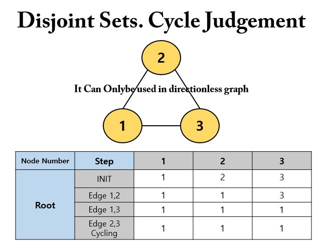

초기 단계에서 자기 자신을 부모로 초기화하고, 각 단계마다 더 작은 값을 갖는 노드를 부모 노드로 변경한다. 

- __동작 방식__
  - 모든 간선을 하나씩 확인하여, 매 간선 마다 union, find 함수를 호출하는 방식
  - 무 방향성 그래프에서만 적용 가능

```java
public class Main {

    private static int vertexCount; // 정점, 노드의 개수
    private static int edgeCount; // 간선의 개수
    private static int[] parents; // 부모 테이블
    private static final int[][] unionSets = new int[][]{ {1, 2}, {1, 3}, {2, 3} }; // union 연산 대상 집합
    private static boolean cycle = false; // 싸이클 발생 여부

    public static void main(String[] args) {
        input();
        initParents();
        if(isOccurCycling()) {
            System.out.println("Occur Cycling");
        } else {
            System.out.println("Not Occur Cycling");
        }
    }

    private static void input() {
        Scanner sc = new Scanner(System.in);
        vertexCount = sc.nextInt();
        edgeCount = sc.nextInt();
    }

    // INIT : 부모 테이블 초기화 -> 초기 root 노드들을 자기 자신으로 설정
    private static void initParents() {
        parents = new int[vertexCount + 1];
        for (int i = 1; i <= vertexCount; i++) {
            parents[i] = i;
        }
    }

    // 싸이클이 발생했는지 판단
    private static boolean isOccurCycling() {
        for(int i=0; i<unionSets.length; i++) {
            int firstVertex = unionSets[i][0];
            int secondVertex = unionSets[i][1];

            // 싸이클 발생 시 종료
            if(findParent(firstVertex) == findParent(secondVertex)) {
                cycle = true;
                break;
            } else { // 싸이클이 발생하지 않으면 union 연산 수행
                unionParent(firstVertex, secondVertex);
            }
        }
        return cycle;
    }

    // find 연산
    private static int findParent(int vertex) {
        if (vertex == parents[vertex]) {
            return vertex;
        }
        return parents[vertex] = findParent(parents[vertex]);
    }

    // union 연산
    private static void unionParent(int firstVertex, int secondVertex) {
        int firstParentVertex = findParent(firstVertex);
        int secondParentVertex = findParent(secondVertex);
        if (firstParentVertex < secondParentVertex) {
            parents[secondParentVertex] = firstParentVertex;
        } else {
            parents[firstParentVertex] = secondParentVertex;
        }
    }
}
```

# 신장 트리(Spanning Tree)

신장 트리(Spanning Tree)란 `하나의 그래프가 있을 때 모든 노드를 포함하면서 사이클이 존재하지 않는 부분 그래프`를 의미한다.

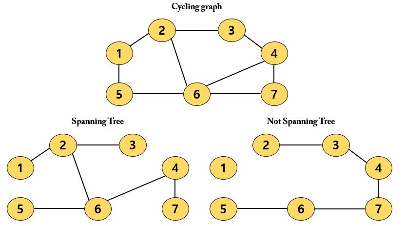

## 크루스칼 알고리즘(Kruskal Algorithm)

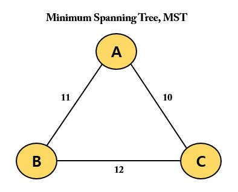

위 그래프에서 각 A, B, C 도시간 도로를 건설하는 비용이 10, 11, 12라고 할때 최소 비용으로 모든 도로를 연결하기 위한 비용은 `10 + 11 = 21` 일 것이다. 따라서, 최소 신장 트리 알고리즘이란 신장 트리 중에서 최소 비용으로 만들 수 있는 신장 트리를 찾는 알고리즘이라고 할 수 있다. 

대표적인 최소 신장 트리 알고리즘(Minimum Spanning Tree, MST)에는 `크루스칼 알고리즘(Kruskal Algorithm)`이 있다. 

크루스칼 알고리즘은 `그리디(Greedy)` 알고리즘으로 분류된다. 크루스칼 알고리즘을 사용하면 가장 적은 비용으로 모든 노드를 연결할 수 있다.

### 동작 과정

- 간선 데이터를 비용에 따라 오름차순으로 정렬
- 간선을 하나씩 확인하며 현재의 간선이 사이클을 발생시키는지 확인
  - 사이클이 발생하지 않는 경우 최소 신장 트리에 포함 O
  - 사이클이 발생하면 최소 신장 트리에 포함 X
- __최소 신장 트리에서 간선의 개수는 `노드의 개수 - 1`과 같다.__

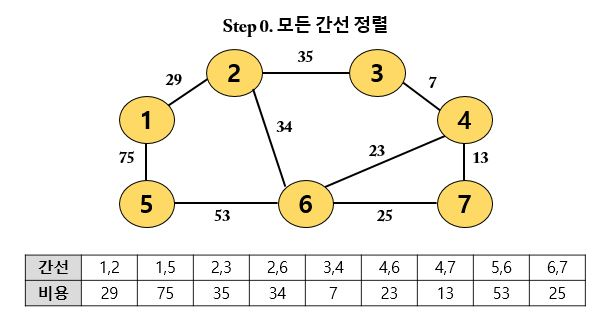

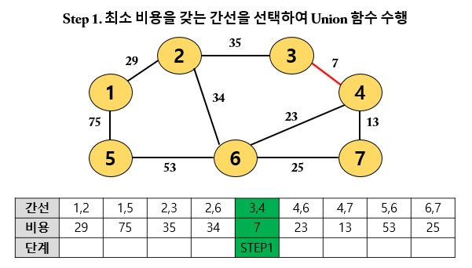

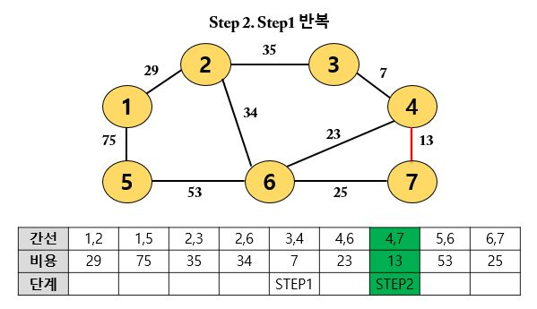

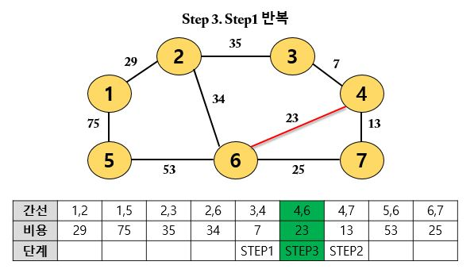

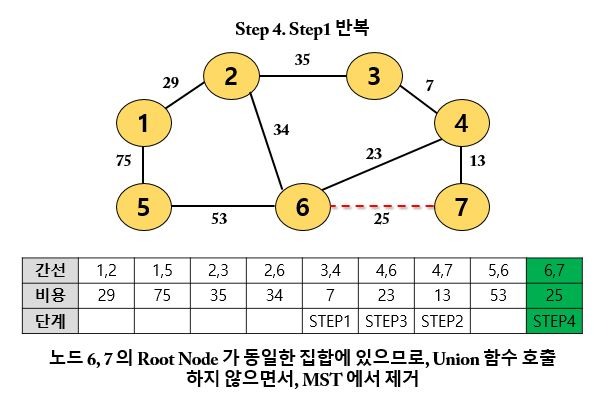

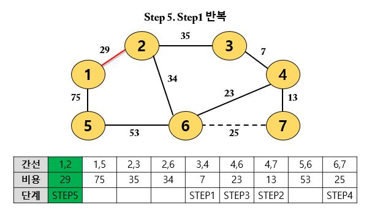

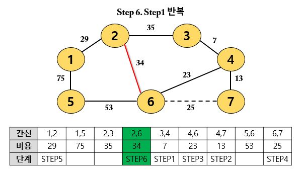

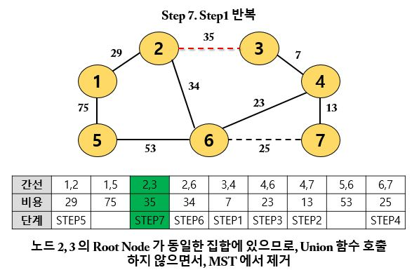

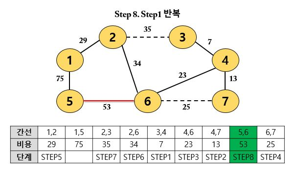

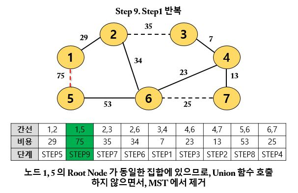

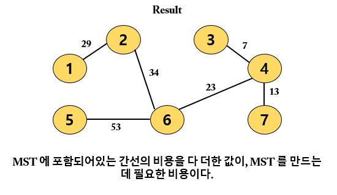

### 구현

```java
// Edge : 간선에 연결되어 있는 노드들과 비용을 저장하기 위한 클래스
class Edge implements Comparable<Edge> {

    private int cost;
    private int nodeA;
    private int nodeB;

    public Edge(int cost, int nodeA, int nodeB) {
        this.cost = cost;
        this.nodeA = nodeA;
        this.nodeB = nodeB;
    }

    public int getCost() {
        return cost;
    }

    public int getNodeA() {
        return nodeA;
    }

    public int getNodeB() {
        return nodeB;
    }

    @Override
    public int compareTo(Edge o) {
        return this.cost - o.cost;
    }
}

public class Main {

    private static int vertexCount; // 노드, 정점
    private static int edgeCount; // 간선의 개수 = Union 연산의 횟수
    private static int[] parents; // 부모 테이블
    private static List<Edge> edges = new ArrayList<>();
    private static int answer = 0; // 문제에서 구하고자 하는 답 : MST 를 만드는데 드는 비용

    public static void main(String[] args) {
        Scanner sc = new Scanner(System.in);
        vertexCount = sc.nextInt();
        edgeCount = sc.nextInt();

        initParents();

        for (int i = 0; i < edgeCount; i++) {
            int a = sc.nextInt();
            int b = sc.nextInt();
            int cost = sc.nextInt();
            edges.add(new Edge(cost, a, b));
        }

        // 간선을 비용순으로 정렬
        Collections.sort(edges);

        // Kruskal Algorithm 수행
        kruskal();

        System.out.println(answer);
    }

    // 부모 테이블을 자기 자신의 노드로 초기화
    private static void initParents() {
        parents = new int[vertexCount + 1];
        for (int i = 1; i <= vertexCount; i++) {
            parents[i] = i;
        }
    }

    // Kruskal Algorithm
    private static void kruskal() {
        // 간선을 하나씩 확인하며
        for (int i = 0; i < edges.size(); i++) {
            int cost = edges.get(i).getCost();
            int nodeA = edges.get(i).getNodeA();
            int nodeB = edges.get(i).getNodeB();

            // 사이클이 발생하지 않는 경우에만 집합에 포함(Union 연산 수행)
            // 즉, nodeA 와 nodeB 에 대한 root 값이 달라야 한다는 의미
            if (findParent(nodeA) != findParent(nodeB)) {
                unionParent(nodeA, nodeB);
                answer += cost; // 최종 비용을 구하기 위한 연산
            }
        }
    }

    // find 연산
    // 특정 원소가 속한 집합을 찾기 : 경로 압축(Path Compression)
    private static int findParent(int vertex) {
        if (vertex == parents[vertex]) return vertex;
        return parents[vertex] = findParent(parents[vertex]);
    }

    // union 연산
    private static void unionParent(int nodeA, int nodeB) {
        nodeA = findParent(nodeA);
        nodeB = findParent(nodeB);
        if (nodeA < nodeB) {
            parents[nodeB] = nodeA;
        } else {
            parents[nodeA] = nodeB;
        }
    }
}
```

# 위상 정렬(Topology Sort)

위상 정렬(Topology Sort)은 순서가 정해져 있는 일련의 작업을 차례대로 수행해야 할 때 사용할 수 있는 알고리즘이다. 즉, `방향 그래프의 모든 노드를 방향성에 거스르지 않도록 순서대로 나열 하는 것`이다.

- __위상 정렬 예시__
  - 선수과목을 고려한 학습 순서 설정
    - A 과목을 수행하고 B 과목을 수강하는 것을 권장할 때, A, B 를 각각 노드로 표현하고 A -> B 로 가는 방향을 갖는 간선을 그린다.
    - 즉, 그래프 상에서 `선, 후 관계`가 존재하면 위상 정렬을 수행하여 모든 선후 관계를 지키는 전체 순서를 계산할 수 있다.
- __진입 차수(Indegree)__
  - 진입 차수(Indegree)란 특정한 노드로 들어오는 간선의 개수를 의미한다. A -> B, B -> C, D -> B 의 관계를 가질 때 B 에 대한 진입 차수는 2이다.
- __동작 과정__
  - 진입 차수가 0인 노드를 큐에 넣는다.
  - 큐가 빌 때까지 다음의 과정을 반복한다.
    - 큐에서 원소를 꺼내 해당 노드에서 출발하는 간선을 그래프에서 제거한다.
    - 새롭게 진입차수가 0이 된 노드를 큐에 넣는다.
- __Tip__
  - 모든 원소를 방문하기 전 큐가 빈다면 사이클(cycling)이 존재한다고 볼 수 있다.
  - 보통 위상 정렬을 사용하라고 낸 문제들은, 사이클이 발생하지 않는다고 명시하는 경우가 많다.

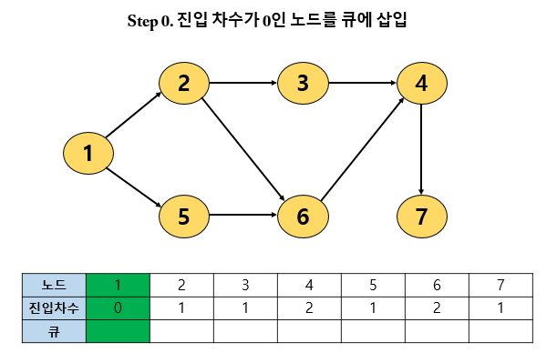

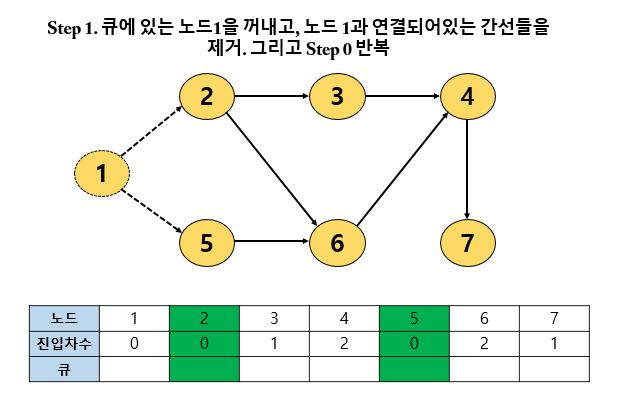

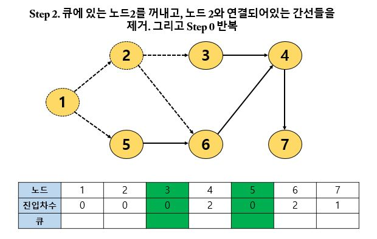

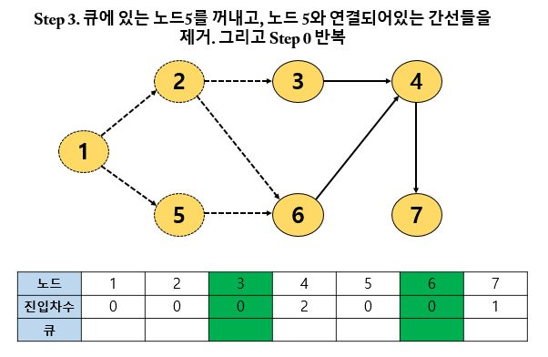

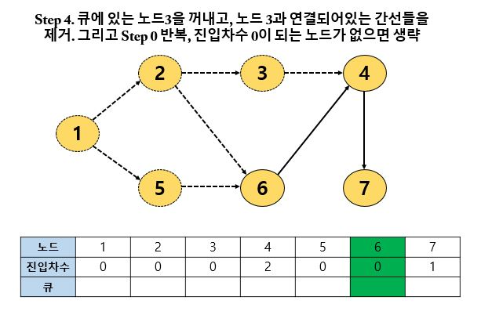

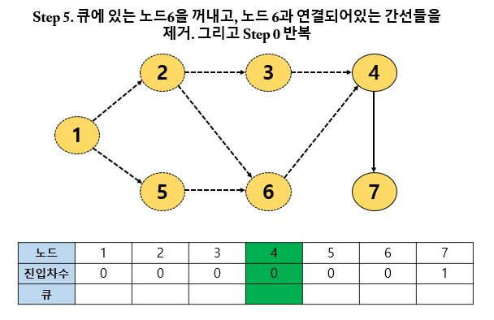

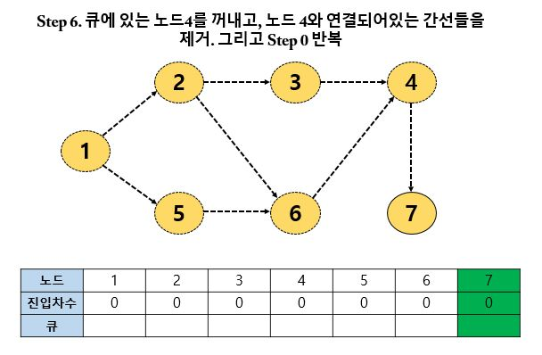

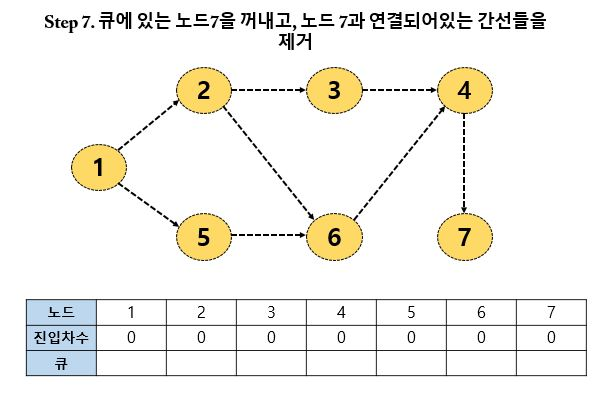

위상 정렬을 수행한 결과는 큐에서 빠져나간 노드를 순서대로 출력하면 된다. 위 그래프의 결과로는 `1-2-5-3-6-4-7` 과 `1-5-2-3-6-4-7` 이 정답이 된다.

## 구현

```java
public class Main {

    private static int vertexCount; // 노드의 개수
    private static int edgeCount; // 간선의 개수
    private static int[] indegree; // 모든 노드에 대한 진입 차수
    private static List<List<Integer>> graph = new ArrayList<>(); // 각 노드에 연결된 간선 정보를 담기 위한 연결 리스트 초기화
    private static List<Integer> result = new ArrayList<>(); // 알고리즘 수행 결과 리스트

    public static void main(String[] args) {
        input();
        topologySort();
        output();
    }

    private static void input() {
        Scanner sc = new Scanner(System.in);
        vertexCount = sc.nextInt();
        edgeCount = sc.nextInt();

        indegree = new int[vertexCount + 1];

        // 그래프 초기화
        for (int i = 0; i <= vertexCount; i++) {
            graph.add(new ArrayList<>());
        }

        // 방향 그래프의 모든 간선 정보를 입력 받기
        for (int i = 0; i < edgeCount; i++) {
            int a = sc.nextInt();
            int b = sc.nextInt();
            graph.get(a).add(b); // A 노드에서 B 로 이동
            indegree[b] += 1; // 진입 차수 1증가
        }
    }

    private static void topologySort() {
        Queue<Integer> Q = new LinkedList<>();

        // step 0. 진입차수가 0인 노드를 큐에 삽입
        for (int i = 1; i <= vertexCount; i++) {
            if (indegree[i] == 0) {
                Q.offer(i);
            }
        }

        // step N. 큐가 빌 때까지 반복
        while(!Q.isEmpty()) {
            // 큐에서 원소 꺼내기
            int now = Q.poll();
            result.add(now);
            // 해당 원소와 연결된 노드들의 진입차수에서 1 빼기
            for (int i = 0; i < graph.get(now).size(); i++) {
                indegree[graph.get(now).get(i)] -= 1;
                // 새롭게 진입차수가 0이 되는 노드를 큐에 삽입
                if (indegree[graph.get(now).get(i)] == 0) {
                    Q.offer(graph.get(now).get(i));
                }
            }
        }
    }

    private static void output() {
        // 위상 정렬을 수행한 결과 출력
        for (int i = 0; i < result.size(); i++) {
            System.out.print(result.get(i) + " ");
        }
    }
}
```

위상 정렬의 시간 복잡도는 모든 노드와 간선을 확인한다는 점에서 `O(V + E)` 이다.
