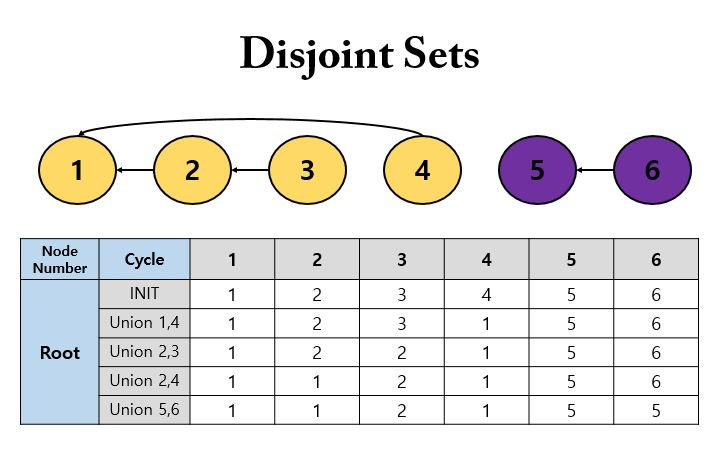

# 서로소 집합(Disjoint Sets)

서로소 집합(Disjoint Sets)은 `공통 원소가 없는 두 집합`을 의미한다. 예를 들면 `{1, 2}`와 `{3, 4}` 가 서로소 집합에 해당된다.

서로소 집합 자료구조란 서로소 부분 집합들로 나누어진 원소들의 데이터를 처리하기 위한 자료구조라고 할 수 있다. 서로소 집합 자료구조는 `union` 과 `find` 이 2개의 연산으로 조작할 수 있다.

- __union(합집합) 연산__
  - 2개의 원소가 포함된 집합을 하나의 집합으로 합치는 연산
- __find(찾기) 연산__
  - 특정한 원소가 속한 집합이 어떤 집합인지 알려주는 연산

즉, 서로소 집합 자료구조는 `합집합`과 `찾기` 연산으로 이루어져 있다. 따라서 `union-find` 자료구조라고도 한다.

## 서로소 집합 자료구조

서로소 집합 자료구조를 구현할 때는 트리 자료구조를 사용하여 집합을 표현한다.

- __서로소 집합 계산 알고리즘__
  - union 연산을 확인하여, 서로 연결된 두 노드 A, B 를 확인한다.
    - A 와 B 의 루트 노드를 각각 찾는다.
    - A 를 B 의 부모 노드로 설정한다. (B 가 A 를 가리키도록 설정)
      - 실제로 구현할 때는 A 와 B 의 루트 노드 중 더 번호가 작은 원소가 부모 노드가 되도록 구현하는 경우가 많다.
  - 모든 union 연산을 처리할 때 까지 1번 과정을 반복한다.

예를 들어 `{1, 2, 3, 4, 5, 6}` 로 이루어진 집합이 있고, `{1, 4}`, `{2, 3}`, `{2, 4}`, `{5, 6}` 의 union 연산이 주어지면 다음과 같은 그래프 형태로 표현할 수 있다.



여기서 `{2, 4}` 에 대한 union 연산을 사용할때를 주의깊게 봐야하는데, 현재 4의 부모 노드는 1이고, 노드 2의 부모 노드는 2이다. 따라서 더 값이 작은 1을 root 노드 2의 부모로 설정한다.
이렇게 union 연산을 다 수행하고 나면, 노란색 노드랑 보라색 노드로 구분 지을 수 있다.

주의 할 점은, union 연산을 계산하기 위해서 `부모 노드 테이블`을 가지고 있어야 한다. 루트 노드를 계산 하기 위해선 간선을 타고 올라가야 한다. 예를 들어, 3의 최종 루트 노드인 1을 찾기 위해서 2를 거쳐서 1로 가야 한다. 

즉, 서로소 집합 알고리즘에서 루트 노드를 찾기 위해서는 `재귀(Recursion)`를 사용하여 간선을 타고 거슬러 올라가야 한다.

최종 구현 코드는 다음과 같다.

```java
public class Main {

    private static int vertexCount; // 정점, 노드의 개수
    private static int edgeCount; // 간선의 개수
    private static int[] parents; // 부모 테이블
    private static final int[][] unionSets = new int[][]{ {1, 4}, {2, 3}, {2, 4}, {5, 6} }; // union 연산 대상 집합

    public static void main(String[] args) {
        input();
        initParents();
        unionOperation();
        output();
    }

    private static void input() {
        Scanner sc = new Scanner(System.in);
        vertexCount = sc.nextInt();
        edgeCount = sc.nextInt();
    }

    // INIT : 부모 테이블 초기화 -> 초기 root 노드들을 자기 자신으로 설정
    private static void initParents() {
        parents = new int[vertexCount + 1];
        for (int i = 1; i <= vertexCount; i++) {
            parents[i] = i;
        }
    }

    // union 연산
    private static void unionOperation() {
        for (int i = 0; i < unionSets.length; i++) {
            int firstVertex = unionSets[i][0];
            int secondVertex = unionSets[i][1];
            int firstParentVertex = findParent(firstVertex);
            int secondParentVertex = findParent(secondVertex);
            if(firstParentVertex < secondParentVertex) {
                parents[secondParentVertex] = firstParentVertex;
            } else {
                parents[firstParentVertex] = secondParentVertex;
            }
        }
    }

    // find 연산
    // 특정 원소가 속한 집합을 찾기
    // 루트 노드 조건 : vertex == parents[vertex] (파라미터로 보낸 노드의 값과 부모 테이블에 저장된 값이 일치)
    private static int findParent(int vertex) {
        // 루트 노드가 아니라면, 루트 노드를 찾을 때까지 재귀적으로 호출
        if (vertex == parents[vertex]) return vertex;
        return findParent(parents[vertex]);
    }

    private static void output() {
        // 각 원소가 속한 집합 출력하기
        System.out.println();
        System.out.print("각 원소가 속한 집합: ");
        for (int i = 1; i <= vertexCount; i++) {
            System.out.print(findParent(i) + " ");
        }
        System.out.println();

        // 부모 테이블 내용 출력하기
        System.out.print("부모 테이블: ");
        for (int i = 1; i <= vertexCount; i++) {
            System.out.print(parents[i] + " ");
        }
        System.out.println();
    }
}
```

위 코드의 단점은 부모 노드를 찾기 위해서 거슬러 올라가야한다는 점인데, 노드의 개수가 V 이고 find or union 연산의 개수가 M 이면 `O(VM)`의 시간 복잡도를 갖게 된다. 
시간 복잡도를 개선하기 위해선 `경로 압축(Path Compression)` 기법을 적용하면 된다.

### 경로 압축(Path Compression)

```java
// 경로 압축 기법 적용
private static int findParentBypathCompression(int vertex) {
    if (vertex == parents[vertex]) return vertex;
    return parents[vertex] = findParent(parents[vertex]);
}
```

위 함수를 수행하면 
